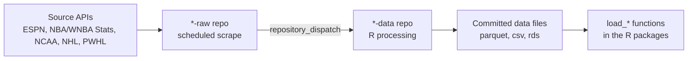

---
output:
  github_document:
    toc: true
    toc_depth: 2
    html_preview: false
---

<!-- README.md is generated from README.Rmd. Please edit README.Rmd and re-render with rmarkdown::render("README.Rmd"). -->

```{r setup, include = FALSE}
knitr::opts_chunk$set(
  echo = FALSE,
  message = FALSE,
  warning = FALSE,
  comment = ""
)
```

# SportsDataverse Data

<!-- badges: start -->
[](https://github.com/sportsdataverse/sportsdataverse-data/actions/workflows/cran-checks.yaml)
[](https://creativecommons.org/licenses/by/4.0/)
<!-- badges: end -->

This repository hosts the helper functions that publish the **automated data
releases** for the [SportsDataverse](https://sportsdataverse.org) ecosystem,
and serves as the **automation status hub** for those pipelines.

Every SportsDataverse dataset is refreshed by a pair of GitHub Actions
pipelines: a `*-raw` repository scrapes a source API on a seasonal schedule,
then dispatches an event to a `*-data` repository that cleans the data and
commits the processed files. The tables below show the live health of every
pipeline.

## Automation status

The badges below are **live** — each GitHub Actions workflow badge shows the
result of that pipeline's most recent run, and each *Last updated* badge
shows when the data repository last received a commit. A red workflow badge
means the latest run of that pipeline failed.

```{r inventory}
inventory <- data.frame(
  sport = c(
    "Basketball", "Basketball", "Basketball", "Basketball", "Basketball",
    "Football", "Hockey", "Hockey"
  ),
  league = c(
    "WNBA", "Women's college basketball", "WNBA Stats", "NBA",
    "Men's college basketball", "College football", "NHL", "PWHL"
  ),
  raw_repo = c(
    "wehoop-wnba-raw", "wehoop-wbb-raw", "wehoop-wnba-stats-raw",
    "hoopR-nba-raw", "hoopR-mbb-raw", "cfbfastR-raw",
    "fastRhockey-nhl-raw", "fastRhockey-pwhl-raw"
  ),
  raw_wf = c(
    "daily_wnba_raw.yml", "daily_wbb_raw.yml", NA,
    "hoopR_nba_data_trigger.yaml", "hoopR_mbb_data_trigger.yaml",
    "cfbfastR_data_trigger.yaml", "scrape_nhl_raw.yml", "scrape_pwhl_raw.yml"
  ),
  data_repo = c(
    "wehoop-wnba-data", "wehoop-wbb-data", "wehoop-wnba-stats-data",
    "hoopR-nba-data", "hoopR-mbb-data", "cfbfastR-data",
    "fastRhockey-nhl-data", "fastRhockey-pwhl-data"
  ),
  data_wf = c(
    "daily_wnba.yml", "daily_wbb.yml", "daily_wnba_stats.yml",
    "daily_nba.yml", "daily_mbb.yml", "daily_cfb.yml",
    "daily_nhl.yml", "daily_pwhl.yml"
  ),
  schedule = c(
    "Daily, late Oct&ndash;mid-Jul", "Daily, late Oct&ndash;early Apr",
    "Daily, May&ndash;Oct", "Daily, late Oct&ndash;mid-Jul",
    "Daily, late Oct&ndash;early Apr", "Game days, Sep&ndash;Dec",
    "Daily, Oct&ndash;Jun", "Daily, Nov&ndash;May"
  ),
  stringsAsFactors = FALSE
)
```

```{r status-tables, results = "asis"}
org <- "https://github.com/sportsdataverse"

# A clickable GitHub Actions workflow status badge. Returns an em-dash for
# data families with no workflow on that side of the pipeline.
workflow_badge <- function(repo, wf) {
  if (is.na(wf)) {
    return("&mdash;")
  }
  sprintf(
    "[](%s/%s/actions/workflows/%s)",
    org, repo, wf, org, repo, wf
  )
}

# A live shields.io "last commit" badge for a data repository.
updated_badge <- function(repo) {
  sprintf(
    paste0(
      "[](%s/%s/commits)"
    ),
    repo, org, repo
  )
}

repo_link <- function(repo) sprintf("[`%s`](%s/%s)", repo, org, repo)

for (sp in c("Basketball", "Football", "Hockey")) {
  sub <- inventory[inventory$sport == sp, ]
  cat("\n### ", sp, "\n\n", sep = "")
  cat("| Dataset | Status (scrape &rarr; process) | Schedule | Last updated |\n")
  cat("|:--|:--|:--|:--|\n")
  for (i in seq_len(nrow(sub))) {
    r <- sub[i, ]
    dataset <- sprintf(
      "**%s**<br/>%s &rarr; %s",
      r$league, repo_link(r$raw_repo), repo_link(r$data_repo)
    )
    status <- paste0(
      workflow_badge(r$raw_repo, r$raw_wf), "<br/>",
      workflow_badge(r$data_repo, r$data_wf)
    )
    cat(sprintf(
      "| %s | %s | %s | %s |\n",
      dataset, status, r$schedule, updated_badge(r$data_repo)
    ))
  }
}
cat("\n")
```

> **What "Last updated" measures.** SportsDataverse data repositories publish
> processed data as committed files — none currently use GitHub release
> assets — so the most recent commit time is an accurate proxy for when fresh
> data was last published.

## How the pipeline works



1. **Scrape** — the `*-raw` repository runs on a seasonal `cron` schedule and
   pulls fresh JSON from the source API.
2. **Dispatch** — on success it fires a `repository_dispatch` event (for
   example `daily_wnba_data`) at the matching `*-data` repository.
3. **Process** — the `*-data` repository runs its R processing workflow,
   cleans and tidies the data, and commits the updated files.
4. **Consume** — the per-sport R packages read those files through their
   `load_*()` functions.

## Update schedule

All times are **UTC**. Schedules are seasonal — pipelines run only during
each sport's competitive window so dormant APIs are not scraped.

### Basketball

- **WNBA** (`wehoop`) — raw scrape near 05:00 and processing near 07:00, daily
  from late October through mid-July. Rosters refresh weekly on Sundays near
  06:00, and an annual job captures the WNBA draft. Dispatch event:
  `daily_wnba_data`.
- **Women's college basketball** (`wehoop`) — raw scrape near 05:00 and
  processing near 07:00, daily from late October through early April,
  covering the regular season, conference tournaments, and the NCAA
  tournament tail. Rosters refresh weekly. Dispatch event: `daily_wbb_data`.
- **WNBA Stats** (`wehoop`) — the WNBA Stats API datasets refresh near 07:00
  daily from May through October, with weekly roster updates.
- **NBA** (`hoopR`) — processing near 07:00, daily from late October through
  mid-July. Dispatch event: `daily_nba_data`.
- **Men's college basketball** (`hoopR`) — processing near 07:00, daily from
  late October through early April. Dispatch event: `daily_mbb_data`.

### Football

- **College football** (`cfbfastR`) — on game days (September through
  December) the pipeline runs in several slots through the day so games are
  captured as they finish; an offseason refresh runs in January and December.
  Annual roster updates run as a separate job. Dispatch event:
  `daily_cfb_data`.

### Hockey

- **NHL** (`fastRhockey`) — raw scrape near 08:00 and processing near 09:00,
  daily from October through June. Dispatch event: `daily_nhl_data`.
- **PWHL** (`fastRhockey`) — raw scrape near 08:00 and processing near 09:00,
  daily from November through May. Dispatch event: `daily_pwhl_data`.

## Consuming the data

Read the processed data through each sport's R package rather than from this
repository directly:

| Package | League(s) | Example loaders |
|:--|:--|:--|
| [`wehoop`](https://wehoop.sportsdataverse.org) | WNBA, WBB | `load_wnba_pbp()`, `load_wbb_team_box()` |
| [`hoopR`](https://hoopR.sportsdataverse.org) | NBA, MBB | `load_nba_pbp()`, `load_mbb_team_box()` |
| [`cfbfastR`](https://cfbfastR.sportsdataverse.org) | College football | `load_cfb_pbp()`, `load_cfb_schedule()` |
| [`fastRhockey`](https://fastRhockey.sportsdataverse.org) | NHL, PWHL | `load_nhl_pbp()`, `load_pwhl_pbp()` |

## Dormant and archived datasets

Some data repositories in the SportsDataverse organization are **not** on an
active schedule and are kept for archival access only — for example
`hoopR-nba-stats-data`, `baseballr-data`, `sportsdataverse-baseball-data`,
`softballR-data`, `sdv-racing-data-repository`, and the legacy `hoopR-data`
and `wehoop-data` archives. Treat data from these as historical snapshots.
