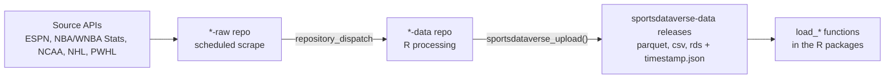

---
output:
  github_document:
    toc: true
    toc_depth: 2
    html_preview: false
---

<!-- README.md is generated from README.Rmd. Please edit README.Rmd and re-render with rmarkdown::render("README.Rmd"). Re-rendering needs network access: the "Data releases" section enumerates this repository's releases live via the GitHub API. -->

```{r setup, include = FALSE}
knitr::opts_chunk$set(
  echo = FALSE,
  message = FALSE,
  warning = FALSE,
  comment = ""
)
```

# SportsDataverse Data

<!-- badges: start -->
[](https://github.com/sportsdataverse/sportsdataverse-data/actions/workflows/cran-checks.yaml)
[](https://creativecommons.org/licenses/by/4.0/)
<!-- badges: end -->

This repository is the **release store and automation status hub** for the
[SportsDataverse](https://sportsdataverse.org) ecosystem. Every processed
SportsDataverse dataset is published here as a GitHub release, and this page
tracks the live health and freshness of every pipeline that produces them.

Each dataset is refreshed by a pair of GitHub Actions pipelines: a `*-raw`
repository scrapes a source API on a seasonal schedule, then dispatches an
event to a `*-data` repository that cleans the data and publishes it here as
release assets.

## Automation status

These badges show whether each pipeline's **scrape** and **processing**
workflows are currently passing — a red badge means that workflow's most
recent run failed. For when each dataset was last *refreshed*, see
[Data releases](#data-releases) below.

```{r inventory}
inventory <- data.frame(
  sport = c(
    "Basketball", "Basketball", "Basketball", "Basketball", "Basketball",
    "Football", "Hockey", "Hockey"
  ),
  league = c(
    "WNBA", "Women's college basketball", "WNBA Stats", "NBA",
    "Men's college basketball", "College football", "NHL", "PWHL"
  ),
  raw_repo = c(
    "wehoop-wnba-raw", "wehoop-wbb-raw", "wehoop-wnba-stats-raw",
    "hoopR-nba-raw", "hoopR-mbb-raw", "cfbfastR-raw",
    "fastRhockey-nhl-raw", "fastRhockey-pwhl-raw"
  ),
  raw_wf = c(
    "daily_wnba_raw.yml", "daily_wbb_raw.yml", NA,
    "hoopR_nba_data_trigger.yaml", "hoopR_mbb_data_trigger.yaml",
    "cfbfastR_data_trigger.yaml", "scrape_nhl_raw.yml", "scrape_pwhl_raw.yml"
  ),
  data_repo = c(
    "wehoop-wnba-data", "wehoop-wbb-data", "wehoop-wnba-stats-data",
    "hoopR-nba-data", "hoopR-mbb-data", "cfbfastR-data",
    "fastRhockey-nhl-data", "fastRhockey-pwhl-data"
  ),
  data_wf = c(
    "daily_wnba.yml", "daily_wbb.yml", "daily_wnba_stats.yml",
    "daily_nba.yml", "daily_mbb.yml", "daily_cfb.yml",
    "daily_nhl.yml", "daily_pwhl.yml"
  ),
  schedule = c(
    "Daily, late Oct&ndash;mid-Jul", "Daily, late Oct&ndash;early Apr",
    "Daily, May&ndash;Oct", "Daily, late Oct&ndash;mid-Jul",
    "Daily, late Oct&ndash;early Apr", "Game days, Sep&ndash;Dec",
    "Daily, Oct&ndash;Jun", "Daily, Nov&ndash;May"
  ),
  stringsAsFactors = FALSE
)
```

```{r status-tables, results = "asis"}
org <- "https://github.com/sportsdataverse"

# A clickable GitHub Actions workflow status badge. Returns an em-dash for
# data families with no workflow on that side of the pipeline.
workflow_badge <- function(repo, wf) {
  if (is.na(wf)) {
    return("&mdash;")
  }
  sprintf(
    "[](%s/%s/actions/workflows/%s)",
    org, repo, wf, org, repo, wf
  )
}

repo_link <- function(repo) sprintf("[`%s`](%s/%s)", repo, org, repo)

for (sp in c("Basketball", "Football", "Hockey")) {
  sub <- inventory[inventory$sport == sp, ]
  cat("\n### ", sp, "\n\n", sep = "")
  cat("| Dataset | Status (scrape &rarr; process) | Schedule |\n")
  cat("|:--|:--|:--|\n")
  for (i in seq_len(nrow(sub))) {
    r <- sub[i, ]
    dataset <- sprintf(
      "**%s**<br/>%s &rarr; %s",
      r$league, repo_link(r$raw_repo), repo_link(r$data_repo)
    )
    status <- paste0(
      workflow_badge(r$raw_repo, r$raw_wf), "<br/>",
      workflow_badge(r$data_repo, r$data_wf)
    )
    cat(sprintf("| %s | %s | %s |\n", dataset, status, r$schedule))
  }
}
cat("\n")
```

### Trigger workflows

After each `*-raw` push lands, a small `repository_dispatch` workflow
fires the matching `*-data` pipeline. These are the bridges between the
scrape and processing badges above:

```{r triggers, results = "asis"}
triggers <- data.frame(
  league = c(
    "NHL", "PWHL", "WNBA", "Women's college basketball",
    "WNBA Draft", "NBA", "Men's college basketball", "College football"
  ),
  repo = c(
    "fastRhockey-nhl-raw", "fastRhockey-pwhl-raw",
    "wehoop-wnba-raw", "wehoop-wbb-raw", "wehoop-wnba-raw",
    "hoopR-nba-raw", "hoopR-mbb-raw", "cfbfastR-raw"
  ),
  wf = c(
    "fastRhockey_nhl_data_trigger.yml", "fastRhockey_pwhl_data_trigger.yml",
    "wehoop_wnba_data_trigger.yml", "wehoop_wbb_data_trigger.yaml",
    "wehoop_wnba_draft_trigger.yml",
    "hoopR_nba_data_trigger.yaml", "hoopR_mbb_data_trigger.yaml",
    "cfbfastR_data_trigger.yaml"
  ),
  stringsAsFactors = FALSE
)

cat("| Pipeline | Trigger workflow | Status |\n")
cat("|:--|:--|:--|\n")
for (i in seq_len(nrow(triggers))) {
  r <- triggers[i, ]
  cat(sprintf(
    "| **%s** | [`%s`](%s/%s/actions/workflows/%s) | %s |\n",
    r$league, r$wf, org, r$repo, r$wf,
    workflow_badge(r$repo, r$wf)
  ))
}
cat("\n")
```

### On-demand and annual workflows

These pipelines do not run on a daily cron. They are dispatched
manually or on a long cycle (annual, by event). Included here so every
active workflow that uploads to or feeds `sportsdataverse-data` is
discoverable from one place.

```{r ondemand, results = "asis"}
ondemand <- data.frame(
  league = c("KenPom (paywalled, data committed in-repo)", "College football rosters"),
  repo   = c("hoopR-kp-data", "cfbfastR-data"),
  wf     = c("update_kenpom.yml", "update_rosters.yml"),
  cadence = c("Manual dispatch", "Annual (cron currently commented out; runs on dispatch)"),
  stringsAsFactors = FALSE
)

cat("| Pipeline | Repo / workflow | Cadence | Status |\n")
cat("|:--|:--|:--|:--|\n")
for (i in seq_len(nrow(ondemand))) {
  r <- ondemand[i, ]
  cat(sprintf(
    "| **%s** | [`%s` &raquo; `%s`](%s/%s/actions/workflows/%s) | %s | %s |\n",
    r$league, r$repo, r$wf, org, r$repo, r$wf, r$cadence,
    workflow_badge(r$repo, r$wf)
  ))
}
cat("\n")
```

### R-package CI

The source R-package repositories sit one step beyond
`sportsdataverse-data` (their `load_*()` helpers consume releases
published here). Their CI runs are included so any package-side
regression that would block the next release is visible from the same
hub.

```{r pkgci, results = "asis"}
pkgci <- data.frame(
  pkg = c("fastRhockey", "hoopR", "wehoop"),
  rcc  = c("R-CMD-check.yaml", "R-CMD-check.yaml", "R-CMD-check.yaml"),
  pkd  = c("pkgdown.yaml", "pkgdown.yaml", "pkgdown.yaml"),
  extras = c(NA, NA, "rhub.yaml"),
  stringsAsFactors = FALSE
)

cat("| Package | R CMD check | pkgdown | Other |\n")
cat("|:--|:--|:--|:--|\n")
for (i in seq_len(nrow(pkgci))) {
  r <- pkgci[i, ]
  extras_cell <- if (is.na(r$extras)) "&mdash;" else workflow_badge(r$pkg, r$extras)
  cat(sprintf(
    "| %s | %s | %s | %s |\n",
    repo_link(r$pkg),
    workflow_badge(r$pkg, r$rcc),
    workflow_badge(r$pkg, r$pkd),
    extras_cell
  ))
}
cat("\n")
```

## Data releases

Every processed dataset is published as a GitHub release of this repository,
tagged by dataset name. On each upload, `sportsdataverse_upload()` attaches a
`timestamp.json` asset recording when the data was last refreshed.

The **Last updated** badge below reads that `timestamp.json` live, so it
always reflects the current state of the release. A release that has data
assets but no `timestamp.json` (uploaded before timestamps were added) shows
its release date instead. Release tags that have no data assets yet are
collapsed into a list at the end of this section. A clearly stale date is the
signal that a dataset is no longer being refreshed.

```{r data-releases, results = "asis"}
# Enumerate this repository's releases live via the GitHub API. gh is already
# an Imports dependency of the package. This call requires network access at
# render time; if it fails, rendering stops with gh's own error message.
releases <- gh::gh(
  "/repos/sportsdataverse/sportsdataverse-data/releases",
  per_page = 100,
  .limit = 1000
)

release_tbl <- data.frame(
  tag = vapply(releases, function(r) r$tag_name, character(1)),
  published = vapply(
    releases, function(r) r$published_at %||% NA_character_, character(1)
  ),
  n_assets = vapply(releases, function(r) length(r$assets), integer(1)),
  # timestamp.json presence is read from the assets already returned above —
  # no extra HTTP request per release.
  has_timestamp = vapply(releases, function(r) {
    "timestamp.json" %in% vapply(r$assets, function(a) a$name, character(1))
  }, logical(1)),
  stringsAsFactors = FALSE
)

# A live shields.io badge that reads the `last_updated` field of a release's
# timestamp.json asset.
timestamp_badge <- function(tag) {
  asset <- sprintf(
    "https://github.com/sportsdataverse/sportsdataverse-data/releases/download/%s/timestamp.json",
    tag
  )
  enc <- utils::URLencode(asset, reserved = TRUE)
  sprintf(
    "",
    enc
  )
}

release_link <- function(tag) {
  sprintf(
    "[`%s`](https://github.com/sportsdataverse/sportsdataverse-data/releases/tag/%s)",
    tag, tag
  )
}

updated_cell <- function(tag, has_timestamp, n_assets, published) {
  if (has_timestamp) {
    return(timestamp_badge(tag))
  }
  if (n_assets == 0) {
    return("*no data published*")
  }
  if (is.na(published)) {
    return("*data present, no timestamp*")
  }
  sprintf("*released %s &mdash; no timestamp*", substr(published, 1, 10))
}

# Ordered sport -> source grouping. Prefixes are mutually exclusive, so the
# first matching prefix classifies a release.
sources <- list(
  list(sport = "Basketball", label = "ESPN WNBA",                       prefix = "espn_wnba_"),
  list(sport = "Basketball", label = "WNBA Stats",                      prefix = "wnba_stats_"),
  list(sport = "Basketball", label = "ESPN women's college basketball", prefix = "espn_womens_college_basketball_"),
  list(sport = "Basketball", label = "ESPN NBA",                        prefix = "espn_nba_"),
  list(sport = "Basketball", label = "ESPN men's college basketball",   prefix = "espn_mens_college_basketball_"),
  list(sport = "Basketball", label = "NBA Stats",                       prefix = "nba_stats_"),
  list(sport = "Football",   label = "cfbfastR",                        prefix = "cfbfastR_cfb_"),
  list(sport = "Football",   label = "ESPN college football",           prefix = "espn_cfb_"),
  list(sport = "Hockey",     label = "NHL",                             prefix = "nhl_"),
  list(sport = "Hockey",     label = "PWHL",                            prefix = "pwhl_"),
  list(sport = "Baseball",   label = "NCAA baseball (archival)",         prefix = "ncaa_baseball_")
)

emit_release_table <- function(rows) {
  cat("| Release | Last updated |\n|:--|:--|\n")
  for (i in seq_len(nrow(rows))) {
    cat(sprintf(
      "| %s | %s |\n",
      release_link(rows$tag[i]),
      updated_cell(
        rows$tag[i], rows$has_timestamp[i], rows$n_assets[i], rows$published[i]
      )
    ))
  }
  cat("\n")
}

# Split data-bearing releases from empty placeholder tags. Empty tags have no
# timestamp to show, so they are listed compactly instead of given table rows.
active <- release_tbl[release_tbl$n_assets > 0, ]
empty <- release_tbl[release_tbl$n_assets == 0, ]

current_sport <- ""
classified <- character(0)
for (s in sources) {
  rows <- active[startsWith(active$tag, s$prefix), ]
  if (nrow(rows) == 0) next
  classified <- c(classified, rows$tag)
  rows <- rows[order(rows$tag), ]
  if (s$sport != current_sport) {
    cat("\n### ", s$sport, "\n", sep = "")
    current_sport <- s$sport
  }
  cat("\n#### ", s$label, "\n\n", sep = "")
  emit_release_table(rows)
}

# Surface any data-bearing release whose tag did not match a known source
# prefix, so a new data family is never silently dropped from the page.
leftover <- active[!active$tag %in% classified, ]
if (nrow(leftover) > 0) {
  cat("\n### Other\n\n")
  emit_release_table(leftover[order(leftover$tag), ])
}

if (nrow(empty) > 0) {
  cat(sprintf(
    paste0(
      "\n<details>\n<summary><b>%d release tags have no data assets yet",
      "</b> (placeholder or retired datasets)</summary>\n\n"
    ),
    nrow(empty)
  ))
  cat(paste0("- `", sort(empty$tag), "`", collapse = "\n"))
  cat("\n\n</details>\n")
}
```

## How the pipeline works



1. **Scrape** — the `*-raw` repository runs on a seasonal `cron` schedule and
   pulls fresh JSON from the source API.
2. **Dispatch** — on success it fires a `repository_dispatch` event (for
   example `daily_wnba_data`) at the matching `*-data` repository.
3. **Process and publish** — the `*-data` repository runs its R processing
   workflow, cleans and tidies the data, and uploads it here as release
   assets — one release per dataset, each stamped with a `timestamp.json`.
4. **Consume** — the per-sport R packages read those release assets through
   their `load_*()` functions.

## Update schedule

All times are **UTC**. Schedules are seasonal — pipelines run only during
each sport's competitive window so dormant APIs are not scraped.

### Basketball

- **WNBA** (`wehoop`) — raw scrape near 05:00 and processing near 07:00, daily
  from late October through mid-July. Rosters refresh weekly on Sundays near
  06:00, and an annual job captures the WNBA draft. Dispatch event:
  `daily_wnba_data`.
- **Women's college basketball** (`wehoop`) — raw scrape near 05:00 and
  processing near 07:00, daily from late October through early April,
  covering the regular season, conference tournaments, and the NCAA
  tournament tail. Rosters refresh weekly. Dispatch event: `daily_wbb_data`.
- **WNBA Stats** (`wehoop`) — the WNBA Stats API datasets refresh near 07:00
  daily from May through October, with weekly roster updates.
- **NBA** (`hoopR`) — processing near 07:00, daily from late October through
  mid-July. Dispatch event: `daily_nba_data`.
- **Men's college basketball** (`hoopR`) — processing near 07:00, daily from
  late October through early April. Dispatch event: `daily_mbb_data`.

### Football

- **College football** (`cfbfastR`) — on game days (September through
  December) the pipeline runs in several slots through the day so games are
  captured as they finish; an offseason refresh runs in January and December.
  Annual roster updates run as a separate job. Dispatch event:
  `daily_cfb_data`.

### Hockey

- **NHL** (`fastRhockey`) — raw scrape near 08:00 and processing near 09:00,
  daily from October through June. Dispatch event: `daily_nhl_data`.
- **PWHL** (`fastRhockey`) — raw scrape near 08:00 and processing near 09:00,
  daily from November through May. Dispatch event: `daily_pwhl_data`.

## Consuming the data

Read the processed data through each sport's R package rather than from the
release assets directly:

| Package | League(s) | Example loaders |
|:--|:--|:--|
| [`wehoop`](https://wehoop.sportsdataverse.org) | WNBA, WBB | `load_wnba_pbp()`, `load_wbb_team_box()` |
| [`hoopR`](https://hoopR.sportsdataverse.org) | NBA, MBB | `load_nba_pbp()`, `load_mbb_team_box()` |
| [`cfbfastR`](https://cfbfastR.sportsdataverse.org) | College football | `load_cfb_pbp()`, `load_cfb_schedule()` |
| [`fastRhockey`](https://fastRhockey.sportsdataverse.org) | NHL, PWHL | `load_nhl_pbp()`, `load_pwhl_pbp()` |

## Dormant and archived datasets

Some data repositories in the SportsDataverse organization are **not** on an
active schedule and are kept for archival access only — for example
`hoopR-nba-stats-data`, `baseballr-data`, `sportsdataverse-baseball-data`,
`softballR-data`, `sdv-racing-data-repository`, and the legacy `hoopR-data`
and `wehoop-data` archives. Release tags above with a clearly stale *Last
updated* date are likewise no longer being refreshed. Treat data from these
as historical snapshots.
