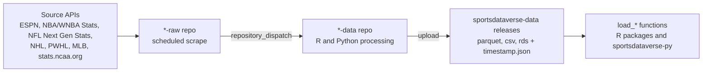

---
output:
  github_document:
    toc: false
    html_preview: false
    pandoc_args: ["--eol=lf"]
---

<!-- README.md is generated from README.Rmd. Edit README.Rmd, run rmarkdown::render("README.Rmd"), then run `npx --yes doctoc@2.5.0 README.md --github` to refill the table of contents. Rendering needs network access: every table is built from the nightly status snapshot in sportsdataverse/.github (status/producers.json, status/summary.json, status/ecosystem.json) and from this repository's releases, read live through the GitHub API. -->

```{r setup, include = FALSE}
knitr::opts_chunk$set(
  echo = FALSE,
  message = FALSE,
  warning = FALSE,
  comment = ""
)
```

```{r status-data}
# Single source: the nightly status snapshot. producers.json is the hand-curated
# tag -> producer map; summary.json carries each producer's state, workflows and
# every release tag's freshness. A failed read stops the render so an empty hub
# is never published.
status_base <- "https://raw.githubusercontent.com/sportsdataverse/.github/main/status/"
read_status <- function(name) {
  x <- tryCatch(
    jsonlite::fromJSON(paste0(status_base, name), simplifyVector = FALSE),
    error = function(e) {
      stop(sprintf(
        "Could not read status/%s from sportsdataverse/.github (%s). Refusing to render an empty status hub.",
        name, conditionMessage(e)
      ), call. = FALSE)
    }
  )
  if (length(x) == 0) stop(sprintf("status/%s is empty.", name), call. = FALSE)
  x
}
producers_cfg <- read_status("producers.json")
summary_json <- read_status("summary.json")
ecosystem <- read_status("ecosystem.json")

producers <- producers_cfg$producers
prod_repos <- vapply(producers, `[[`, "", "repo")
prod_sports <- vapply(producers, `[[`, "", "sport")
snap <- setNames(
  summary_json$producers,
  vapply(summary_json$producers, `[[`, "", "repo")
)
if (length(producers) == 0 || length(summary_json$release_tags) == 0) {
  stop("The status snapshot lists no producers or no release tags.", call. = FALSE)
}

org <- "https://github.com"
sport_name <- function(x) {
  switch(x,
    football = "Football", basketball = "Basketball", hockey = "Hockey",
    baseball = "Baseball", multi = "Multi-sport reference",
    tools::toTitleCase(x)
  )
}
repo_link <- function(repo) {
  sprintf("[`%s`](%s/%s)", sub("^sportsdataverse/", "", repo), org, repo)
}
wf_page <- function(repo, file) {
  sprintf("%s/%s/actions/workflows/%s", org, repo, basename(file))
}
# A shields.io endpoint badge over one of the snapshot's badge files.
badge <- function(path, alt, link) {
  src <- utils::URLencode(paste0(status_base, "badges/", path), reserved = TRUE)
  sprintf("[](%s)", alt, src, link)
}
# A workflow's endpoint badge, or a plain link when the snapshot has no badge.
wf_badge <- function(repo, w) {
  if (is.null(w$badge)) {
    return(sprintf("[`%s`](%s)", basename(w$file), wf_page(repo, w$file)))
  }
  badge(w$badge, w$name, wf_page(repo, w$file))
}
wf_cell <- function(repo, wfs) {
  if (length(wfs) == 0) return("&mdash;")
  paste(vapply(wfs, function(w) wf_badge(repo, w), ""), collapse = " ")
}
badge_dir <- function(repo) snap[[repo]]$badge_dir %||% basename(repo)
producer_badges <- function(repo) {
  dir <- badge_dir(repo)
  paste(
    badge(paste0(dir, "/status.json"), "pipeline", "https://sportsdataverse.org/status"),
    badge(paste0(dir, "/updated.json"), "data updated", paste0(org, "/", repo)),
    badge(paste0(dir, "/through.json"), "through", paste0(org, "/", repo))
  )
}
```

# SportsDataverse Data <a href='https://sportsdataverse.org/'></a>

<!-- badges: start -->
[](https://github.com/sportsdataverse/sportsdataverse-data/actions/workflows/cran-checks.yaml)
[](https://creativecommons.org/licenses/by/4.0/)
<!-- badges: end -->

This repository is the **release store** of the
[SportsDataverse](https://sportsdataverse.org): every `load_*()` function in
the SportsDataverse R packages and in `sportsdataverse-py` reads its data from
the GitHub releases published here. This page shows how fresh each release is,
which repository produces it, and whether the pipelines behind it are passing.

Live status: [sportsdataverse.org/status](https://sportsdataverse.org/status)
&middot; nightly snapshot:
[`status/ecosystem.md`](https://github.com/sportsdataverse/.github/blob/main/status/ecosystem.md)

<!-- START doctoc generated TOC please keep comment here to allow auto update -->
<!-- END doctoc generated TOC please keep comment here to allow auto update -->

## Data releases

Every processed dataset is a GitHub release of this repository, tagged by
dataset name and grouped below by sport and by the repository that produces
it. Above each table are that producer's badges: its **pipeline** state, when
its play-by-play data was last **updated**, and the latest season it runs
**through** (see [How to read the badges](#how-to-read-the-badges)).

In each table, **Last updated** reads the release's `timestamp.json` asset
live; a release without one shows the date of its newest asset in the nightly
snapshot. **Through season** is the newest season in the release's asset
names. Release tags with no data assets yet are listed at the end.

```{r data-releases, results = "asis"}
# Enumerate this repository's releases live via the GitHub API (gh is an
# Imports dependency of the package). The owner's token can see draft
# releases, so drafts are dropped.
releases <- gh::gh(
  "/repos/sportsdataverse/sportsdataverse-data/releases",
  per_page = 100,
  .limit = Inf
)
releases <- Filter(function(r) !isTRUE(r$draft), releases)
if (length(releases) == 0) stop("No releases returned by the GitHub API.", call. = FALSE)

asset_field <- function(r, field) vapply(r$assets, `[[`, "", field)
rel <- data.frame(
  tag = vapply(releases, `[[`, "", "tag_name"),
  n_assets = vapply(releases, function(r) length(r$assets), 1L),
  has_timestamp = vapply(
    releases, function(r) "timestamp.json" %in% asset_field(r, "name"), NA
  ),
  live_newest = vapply(
    releases, function(r) max(c("", asset_field(r, "updated_at"))), ""
  ),
  stringsAsFactors = FALSE
)

tags <- summary_json$release_tags
snap_tags <- data.frame(
  tag = vapply(tags, `[[`, "", "tag"),
  producer = vapply(tags, function(x) x$producer %||% NA_character_, ""),
  newest = vapply(tags, function(x) x$newest_asset_at %||% NA_character_, ""),
  max_season = vapply(tags, function(x) as.integer(x$max_season %||% NA), 1L),
  stringsAsFactors = FALSE
)
rel <- merge(rel, snap_tags, by = "tag", all.x = TRUE, sort = TRUE)

# A live shields.io badge that reads the `last_updated` field of a release's
# timestamp.json asset.
timestamp_badge <- function(tag) {
  asset <- sprintf(
    "https://github.com/sportsdataverse/sportsdataverse-data/releases/download/%s/timestamp.json",
    tag
  )
  sprintf(
    "",
    utils::URLencode(asset, reserved = TRUE)
  )
}
release_link <- function(tag) {
  sprintf(
    "[`%s`](https://github.com/sportsdataverse/sportsdataverse-data/releases/tag/%s)",
    tag, tag
  )
}
updated_cell <- function(r) {
  if (r$has_timestamp) return(timestamp_badge(r$tag))
  newest <- if (is.na(r$newest)) r$live_newest else r$newest
  sprintf("%s &middot; newest asset", substr(newest, 1, 10))
}
emit_release_table <- function(rows) {
  cat("| Release | Last updated | Through season |\n|:--|:--|:--|\n")
  for (i in seq_len(nrow(rows))) {
    r <- rows[i, ]
    cat(sprintf(
      "| %s | %s | %s |\n",
      release_link(r$tag), updated_cell(r),
      if (is.na(r$max_season)) "&mdash;" else r$max_season
    ))
  }
  cat("\n")
}

active <- rel[rel$n_assets > 0, ]
empty <- rel[rel$n_assets == 0, ]

for (sp in unique(prod_sports)) {
  cat("\n### ", sport_name(sp), "\n", sep = "")
  for (p in producers[prod_sports == sp]) {
    cat("\n#### ", p$label, "\n\n", sep = "")
    cat(producer_badges(p$repo), "\n\n", sep = "")
    cat(
      "Produced by ", repo_link(p$repo),
      if (!is.null(p$raw_repo)) paste0(" from ", repo_link(p$raw_repo)),
      ".\n\n",
      sep = ""
    )
    rows <- active[active$producer %in% p$repo, ]
    if (nrow(rows) == 0) {
      cat("*No release with data assets yet.*\n\n")
    } else {
      emit_release_table(rows)
    }
  }
}

# Safety net: a data-bearing release the snapshot does not attribute to a
# producer (its `unmapped_tags`, or a tag newer than the last snapshot) is
# listed here so a new data family is never silently dropped from the page.
unattributed <- active[!(active$producer %in% prod_repos), ]
if (nrow(unattributed) > 0) {
  cat(
    "\n### Unattributed releases\n\n",
    "These releases match no producer rule in the status snapshot's ",
    "`producers.json` (they are reported there as `unmapped_tags`), or they ",
    "appeared after the last nightly snapshot.\n\n",
    sep = ""
  )
  emit_release_table(unattributed)
}

if (nrow(empty) > 0) {
  cat(sprintf(
    paste0(
      "\n<details>\n<summary><b>%d release tags have no data assets yet",
      "</b> (placeholder or retired datasets)</summary>\n\n"
    ),
    nrow(empty)
  ))
  cat(paste0("- `", sort(empty$tag), "`", collapse = "\n"))
  cat("\n\n</details>\n")
}
```

## Automation status

Each producer's update workflows, with the status and date of their latest
run. Click a badge for the workflow's run history. The schedule is the one
recorded in the status snapshot's `producers.json`.

```{r automation-status, results = "asis"}
for (sp in unique(prod_sports)) {
  cat("\n### ", sport_name(sp), "\n\n", sep = "")
  cat("| Producer | Schedule | Update workflows |\n|:--|:--|:--|\n")
  for (p in producers[prod_sports == sp]) {
    who <- paste0("**", p$label, "**<br/>", repo_link(p$repo))
    if (!is.null(p$raw_repo)) who <- paste0(who, " &larr; ", repo_link(p$raw_repo))
    cat(sprintf(
      "| %s | %s | %s |\n",
      who, gsub("|", "\\|", p$schedule, fixed = TRUE),
      wf_cell(p$repo, snap[[p$repo]]$workflows)
    ))
  }
}
cat("\n")
```

### Trigger workflows

After a `*-raw` push lands, a small `repository_dispatch` workflow in the raw
repository fires the matching producer. These are the bridges between the raw
and producer repositories above. The status snapshot keeps no badge for them,
so they are plain links; a *disabled* trigger means the producer no longer
waits on it and runs on its own schedule instead.

```{r triggers, results = "asis"}
cat("| Producer | Trigger workflow |\n|:--|:--|\n")
for (p in producers) {
  if (is.null(p$raw_repo)) next
  wfs <- ecosystem$repos[[p$raw_repo]]$workflows
  wfs <- Filter(function(w) grepl("trigger", w$name, ignore.case = TRUE), wfs)
  for (w in wfs) {
    cat(sprintf(
      "| **%s** | [`%s` &raquo; `%s`](%s)%s |\n",
      p$label, sub("^sportsdataverse/", "", p$raw_repo), basename(w$file),
      wf_page(p$raw_repo, w$file),
      if (identical(w$state, "active")) "" else " *(disabled)*"
    ))
  }
}
cat("\n")
```

### On-demand and annual workflows

Draft, model and roster jobs that belong to a producer appear in its row
above. One more workflow feeds this repository only when dispatched by hand:

| Pipeline | Repo / workflow | Cadence |
|:--|:--|:--|
| **College football rosters** | [`cfbfastR-data` &raquo; `update_rosters.yml`](https://github.com/sportsdataverse/cfbfastR-data/actions/workflows/update_rosters.yml) | Manual dispatch, once a year |

### Package CI

The package repositories whose loaders read these releases. Their CI is shown
here so a package-side regression that would block the next release is
visible from the same page.

```{r package-ci, results = "asis"}
cat("| Package | R CMD check | pkgdown | Other workflows |\n|:--|:--|:--|:--|\n")
for (pk in summary_json$packages) {
  stem <- vapply(pk$workflows, function(w) sub("\\.ya?ml$", "", basename(w$file)), "")
  main <- stem %in% c("R-CMD-check", "pkgdown")
  cat(sprintf(
    "| %s | %s | %s | %s |\n",
    repo_link(pk$repo),
    wf_cell(pk$repo, pk$workflows[stem == "R-CMD-check"]),
    wf_cell(pk$repo, pk$workflows[stem == "pkgdown"]),
    wf_cell(pk$repo, pk$workflows[!main])
  ))
}
cat("\n")
```

## How to read the badges

- **pipeline** reads `fresh`, `idle (off-season)`, `stale Nd` or `failing`.
  *Idle* means the producer is outside its season window (see
  [Update schedule](#update-schedule)), not that it is broken; idle never turns
  a badge red. *Stale* means it is in season and its play-by-play has gone
  longer than its threshold without a new asset. *Failing* means the latest
  run of one of its update workflows failed after its newest data landed.
- **data updated** and **through** follow the producer's play-by-play tags, so
  a schedule file published ahead of a season does not advance them and an
  unrelated daily output cannot hide stalled play-by-play.
- A **workflow badge** shows that workflow's latest run and its date
  (`passing · date`, `failing · date`, `disabled · date`), whatever event
  triggered it.
- Every badge is rebuilt nightly from the status snapshot. The exception is
  the **Last updated** column under [Data releases](#data-releases), which
  reads each release's `timestamp.json` live.

## How the pipeline works


```mermaid
flowchart LR
  API["Source APIs<br/>ESPN, NBA/WNBA Stats, NFL Next Gen Stats,<br/>NHL, PWHL, MLB, stats.ncaa.org"]
  RAW["*-raw repo<br/>scheduled scrape"]
  DATA["*-data repo<br/>R and Python processing"]
  REL["sportsdataverse-data releases<br/>parquet, csv, rds + timestamp.json"]
  LOAD["load_* functions<br/>R packages and sportsdataverse-py"]
  API --> RAW
  RAW -->|"repository_dispatch"| DATA
  DATA -->|"upload"| REL
  REL --> LOAD
```

1. **Scrape** — the `*-raw` repository runs on a seasonal schedule and
   captures fresh JSON from the source API. Sources that block datacenter
   IPs or need a strict rate budget are captured from the SportsDataverse
   droplet instead of GitHub-hosted runners.
2. **Dispatch** — a [trigger workflow](#trigger-workflows) fires a
   `repository_dispatch` event at the matching `*-data` repository; some
   producers run on their own schedule instead.
3. **Process and publish** — the producer builds the datasets and uploads
   them here as release assets, one release per dataset. For example,
   `cfbfastR-cfb-raw` captures ESPN college-football games and
   `cfbfastR-cfb-data` builds and publishes every `espn_cfb_*` release.
4. **Consume** — the R packages and `sportsdataverse-py` read those release
   assets through their `load_*()` functions.

## Update schedule

Each producer runs only inside its sport's season window, so dormant APIs
are not scraped; its cadence is the **Schedule** column under
[Automation status](#automation-status). These are the windows the status
snapshot uses: outside its window a producer reads *idle*, and inside it a
producer reads *stale* once its play-by-play goes longer than the threshold
without a new asset.

```{r update-schedule, results = "asis"}
md <- function(x) {
  paste(month.abb[as.integer(substr(x, 1, 2))], as.integer(substr(x, 4, 5)))
}
cat("| Producer | Season window | Stale after |\n|:--|:--|:--|\n")
for (p in producers) {
  window <- if (p$season$start == "01-01" && p$season$end == "12-31") {
    "All year"
  } else {
    paste(md(p$season$start), "&ndash;", md(p$season$end))
  }
  cat(sprintf(
    "| %s (%s) | %s | %s days |\n",
    p$label, repo_link(p$repo), window, p$stale_after_days
  ))
}
cat("\n")
```

## Consuming the data

Read the processed data through each sport's package rather than from the
release assets directly:

| Package | League(s) | Example loaders |
|:--|:--|:--|
| [`wehoop`](https://wehoop.sportsdataverse.org) | WNBA, WBB | `load_wnba_pbp()`, `load_wbb_team_box()` |
| [`hoopR`](https://hoopR.sportsdataverse.org) | NBA, MBB | `load_nba_pbp()`, `load_mbb_team_box()` |
| [`cfbfastR`](https://cfbfastR.sportsdataverse.org) | College football | `load_espn_cfb_pbp()`, `load_cfb_pbp()`, `load_cfb_schedules()` |
| [`fastRhockey`](https://fastRhockey.sportsdataverse.org) | NHL, PWHL | `load_nhl_pbp()`, `load_pwhl_pbp()` |
| [`baseballr`](https://billpetti.github.io/baseballr/) | MLB, college baseball | `load_ncaa_baseball_pbp()`, `load_mlb_expected_stats()` |
| [`sportsdataverse-py`](https://py.sportsdataverse.org) | All of the above, plus NFL | `sportsdataverse.nfl.load_nfl_pbp(source="sdv")`, `sportsdataverse.mlb.load_mlb_pbp()` |

## Dormant and archived datasets

Some data repositories in the SportsDataverse organization are **not** on an
active schedule and are kept for archival access only — for example
`sportsdataverse-baseball-data`, `softballR-data`,
`sdv-racing-data-repository`, and the archived `hoopR-data` and `wehoop-data`.
In this repository the `phf_*` releases are a frozen archive (the PHF ceased
operations in 2023), and `nhl_xg_models` has no public producer; both are
listed under *Unattributed releases* above. A release whose *Last updated*
date is well behind its producer's badges is likewise no longer being
refreshed. Treat data from these as historical snapshots.

## Repository layout

<!-- BEGIN GENERATED: layout -->

```
sportsdataverse-data/
├── R/   # R pipeline stages and publish toolchain
│   ├── gh_cli.R
│   ├── upload.R
│   └── zzz.R
├── data-raw/
├── docs/   # explainers, model reports and dataset docs
│   └── superpowers/
└── man/   # generated R documentation
    └── figures/
```

<!-- END GENERATED: layout -->
