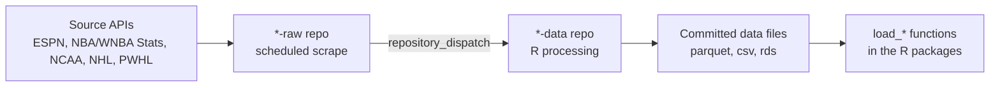

  - [SportsDataverse Data](#sportsdataverse-data)
      - [Automation status](#automation-status)
      - [How the pipeline works](#how-the-pipeline-works)
      - [Update schedule](#update-schedule)
      - [Consuming the data](#consuming-the-data)
      - [Dormant and archived datasets](#dormant-and-archived-datasets)

<!-- README.md is generated from README.Rmd. Please edit README.Rmd and re-render with rmarkdown::render("README.Rmd"). -->

# SportsDataverse Data

<!-- badges: start -->

<!-- badges: end -->

This repository hosts the helper functions that publish the **automated
data releases** for the [SportsDataverse](https://sportsdataverse.org)
ecosystem, and serves as the **automation status hub** for those
pipelines.

Every SportsDataverse dataset is refreshed by a pair of GitHub Actions
pipelines: a `*-raw` repository scrapes a source API on a seasonal
schedule, then dispatches an event to a `*-data` repository that cleans
the data and commits the processed files. The tables below show the live
health of every pipeline.

## Automation status

The badges below are **live** — each GitHub Actions workflow badge shows
the result of that pipeline’s most recent run, and each *Last updated*
badge shows when the data repository last received a commit. A red
workflow badge means the latest run of that pipeline failed.

### Basketball

| Dataset                                                                                                                                                                                        | Status (scrape → process)                                                                                                                                                                                                                                                                                                                                                                                             | Schedule                  | Last updated                                                                                                                                                                                          |
| :--------------------------------------------------------------------------------------------------------------------------------------------------------------------------------------------- | :-------------------------------------------------------------------------------------------------------------------------------------------------------------------------------------------------------------------------------------------------------------------------------------------------------------------------------------------------------------------------------------------------------------------- | :------------------------ | :---------------------------------------------------------------------------------------------------------------------------------------------------------------------------------------------------- |
| **WNBA** [`wehoop-wnba-raw`](https://github.com/sportsdataverse/wehoop-wnba-raw) → [`wehoop-wnba-data`](https://github.com/sportsdataverse/wehoop-wnba-data)                               |           | Daily, late Oct–mid-Jul   |              |
| **Women’s college basketball** [`wehoop-wbb-raw`](https://github.com/sportsdataverse/wehoop-wbb-raw) → [`wehoop-wbb-data`](https://github.com/sportsdataverse/wehoop-wbb-data)             |                   | Daily, late Oct–early Apr |                |
| **WNBA Stats** [`wehoop-wnba-stats-raw`](https://github.com/sportsdataverse/wehoop-wnba-stats-raw) → [`wehoop-wnba-stats-data`](https://github.com/sportsdataverse/wehoop-wnba-stats-data) | —                                                                                                                                                                                        | Daily, May–Oct            |  |
| **NBA** [`hoopR-nba-raw`](https://github.com/sportsdataverse/hoopR-nba-raw) → [`hoopR-nba-data`](https://github.com/sportsdataverse/hoopR-nba-data)                                        |   | Daily, late Oct–mid-Jul   |                  |
| **Men’s college basketball** [`hoopR-mbb-raw`](https://github.com/sportsdataverse/hoopR-mbb-raw) → [`hoopR-mbb-data`](https://github.com/sportsdataverse/hoopR-mbb-data)                   |   | Daily, late Oct–early Apr |                  |

### Football

| Dataset                                                                                                                                                          | Status (scrape → process)                                                                                                                                                                                                                                                                                                                                                                                       | Schedule           | Last updated                                                                                                                                                                        |
| :--------------------------------------------------------------------------------------------------------------------------------------------------------------- | :-------------------------------------------------------------------------------------------------------------------------------------------------------------------------------------------------------------------------------------------------------------------------------------------------------------------------------------------------------------------------------------------------------------- | :----------------- | :---------------------------------------------------------------------------------------------------------------------------------------------------------------------------------- |
| **College football** [`cfbfastR-raw`](https://github.com/sportsdataverse/cfbfastR-raw) → [`cfbfastR-data`](https://github.com/sportsdataverse/cfbfastR-data) |   | Game days, Sep–Dec |  |

### Hockey

| Dataset                                                                                                                                                                              | Status (scrape → process)                                                                                                                                                                                                                                                                                                                                                                                                           | Schedule       | Last updated                                                                                                                                                                                        |
| :----------------------------------------------------------------------------------------------------------------------------------------------------------------------------------- | :---------------------------------------------------------------------------------------------------------------------------------------------------------------------------------------------------------------------------------------------------------------------------------------------------------------------------------------------------------------------------------------------------------------------------------- | :------------- | :-------------------------------------------------------------------------------------------------------------------------------------------------------------------------------------------------- |
| **NHL** [`fastRhockey-nhl-raw`](https://github.com/sportsdataverse/fastRhockey-nhl-raw) → [`fastRhockey-nhl-data`](https://github.com/sportsdataverse/fastRhockey-nhl-data)      |           | Daily, Oct–Jun |    |
| **PWHL** [`fastRhockey-pwhl-raw`](https://github.com/sportsdataverse/fastRhockey-pwhl-raw) → [`fastRhockey-pwhl-data`](https://github.com/sportsdataverse/fastRhockey-pwhl-data) |   | Daily, Nov–May |  |

> **What “Last updated” measures.** SportsDataverse data repositories
> publish processed data as committed files — none currently use GitHub
> release assets — so the most recent commit time is an accurate proxy
> for when fresh data was last published.

## How the pipeline works

1.  **Scrape** — the `*-raw` repository runs on a seasonal `cron`
    schedule and pulls fresh JSON from the source API.
2.  **Dispatch** — on success it fires a `repository_dispatch` event
    (for example `daily_wnba_data`) at the matching `*-data` repository.
3.  **Process** — the `*-data` repository runs its R processing
    workflow, cleans and tidies the data, and commits the updated files.
4.  **Consume** — the per-sport R packages read those files through
    their `load_*()` functions.

## Update schedule

All times are **UTC**. Schedules are seasonal — pipelines run only
during each sport’s competitive window so dormant APIs are not scraped.

### Basketball

  - **WNBA** (`wehoop`) — raw scrape near 05:00 and processing near
    07:00, daily from late October through mid-July. Rosters refresh
    weekly on Sundays near 06:00, and an annual job captures the WNBA
    draft. Dispatch event: `daily_wnba_data`.
  - **Women’s college basketball** (`wehoop`) — raw scrape near 05:00
    and processing near 07:00, daily from late October through early
    April, covering the regular season, conference tournaments, and the
    NCAA tournament tail. Rosters refresh weekly. Dispatch event:
    `daily_wbb_data`.
  - **WNBA Stats** (`wehoop`) — the WNBA Stats API datasets refresh near
    07:00 daily from May through October, with weekly roster updates.
  - **NBA** (`hoopR`) — processing near 07:00, daily from late October
    through mid-July. Dispatch event: `daily_nba_data`.
  - **Men’s college basketball** (`hoopR`) — processing near 07:00,
    daily from late October through early April. Dispatch event:
    `daily_mbb_data`.

### Football

  - **College football** (`cfbfastR`) — on game days (September through
    December) the pipeline runs in several slots through the day so
    games are captured as they finish; an offseason refresh runs in
    January and December. Annual roster updates run as a separate job.
    Dispatch event: `daily_cfb_data`.

### Hockey

  - **NHL** (`fastRhockey`) — raw scrape near 08:00 and processing near
    09:00, daily from October through June. Dispatch event:
    `daily_nhl_data`.
  - **PWHL** (`fastRhockey`) — raw scrape near 08:00 and processing near
    09:00, daily from November through May. Dispatch event:
    `daily_pwhl_data`.

## Consuming the data

Read the processed data through each sport’s R package rather than from
this repository directly:

| Package                                                  | League(s)        | Example loaders                          |
| :------------------------------------------------------- | :--------------- | :--------------------------------------- |
| [`wehoop`](https://wehoop.sportsdataverse.org)           | WNBA, WBB        | `load_wnba_pbp()`, `load_wbb_team_box()` |
| [`hoopR`](https://hoopR.sportsdataverse.org)             | NBA, MBB         | `load_nba_pbp()`, `load_mbb_team_box()`  |
| [`cfbfastR`](https://cfbfastR.sportsdataverse.org)       | College football | `load_cfb_pbp()`, `load_cfb_schedule()`  |
| [`fastRhockey`](https://fastRhockey.sportsdataverse.org) | NHL, PWHL        | `load_nhl_pbp()`, `load_pwhl_pbp()`      |

## Dormant and archived datasets

Some data repositories in the SportsDataverse organization are **not**
on an active schedule and are kept for archival access only — for
example `hoopR-nba-stats-data`, `baseballr-data`,
`sportsdataverse-baseball-data`, `softballR-data`,
`sdv-racing-data-repository`, and the legacy `hoopR-data` and
`wehoop-data` archives. Treat data from these as historical snapshots.
