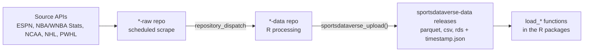

<!-- README.md is generated from README.Rmd. Please edit README.Rmd and re-render with rmarkdown::render("README.Rmd"). Re-rendering needs network access: the "Data releases" section enumerates this repository's releases live via the GitHub API. -->

# SportsDataverse Data

<!-- badges: start -->

<!-- badges: end -->

This repository is the **release store and automation status hub** for
the [SportsDataverse](https://sportsdataverse.org) ecosystem. Every
processed SportsDataverse dataset is published here as a GitHub release,
and this page tracks the live health and freshness of every pipeline
that produces them.

Each dataset is refreshed by a pair of GitHub Actions pipelines: a
`*-raw` repository scrapes a source API on a seasonal schedule, then
dispatches an event to a `*-data` repository that cleans the data and
publishes it here as release assets.

## Automation status

These badges show whether each pipeline’s **scrape** and **processing**
workflows are currently passing — a red badge means that workflow’s most
recent run failed. For when each dataset was last *refreshed*, see [Data
releases](#data-releases) below.

### Basketball

| Dataset                                                                                                                                                                                        | Status (scrape → process)                                                                                                                                                                                                                                                                                                                                                                                             | Schedule                  |
| :--------------------------------------------------------------------------------------------------------------------------------------------------------------------------------------------- | :-------------------------------------------------------------------------------------------------------------------------------------------------------------------------------------------------------------------------------------------------------------------------------------------------------------------------------------------------------------------------------------------------------------------- | :------------------------ |
| **WNBA** [`wehoop-wnba-raw`](https://github.com/sportsdataverse/wehoop-wnba-raw) → [`wehoop-wnba-data`](https://github.com/sportsdataverse/wehoop-wnba-data)                               |           | Daily, late Oct–mid-Jul   |
| **Women’s college basketball** [`wehoop-wbb-raw`](https://github.com/sportsdataverse/wehoop-wbb-raw) → [`wehoop-wbb-data`](https://github.com/sportsdataverse/wehoop-wbb-data)             |                   | Daily, late Oct–early Apr |
| **WNBA Stats** [`wehoop-wnba-stats-raw`](https://github.com/sportsdataverse/wehoop-wnba-stats-raw) → [`wehoop-wnba-stats-data`](https://github.com/sportsdataverse/wehoop-wnba-stats-data) | —                                                                                                                                                                                        | Daily, May–Oct            |
| **NBA** [`hoopR-nba-raw`](https://github.com/sportsdataverse/hoopR-nba-raw) → [`hoopR-nba-data`](https://github.com/sportsdataverse/hoopR-nba-data)                                        |   | Daily, late Oct–mid-Jul   |
| **Men’s college basketball** [`hoopR-mbb-raw`](https://github.com/sportsdataverse/hoopR-mbb-raw) → [`hoopR-mbb-data`](https://github.com/sportsdataverse/hoopR-mbb-data)                   |   | Daily, late Oct–early Apr |

### Football

| Dataset                                                                                                                                                          | Status (scrape → process)                                                                                                                                                                                                                                                                                                                                                                                       | Schedule           |
| :--------------------------------------------------------------------------------------------------------------------------------------------------------------- | :-------------------------------------------------------------------------------------------------------------------------------------------------------------------------------------------------------------------------------------------------------------------------------------------------------------------------------------------------------------------------------------------------------------- | :----------------- |
| **College football** [`cfbfastR-raw`](https://github.com/sportsdataverse/cfbfastR-raw) → [`cfbfastR-data`](https://github.com/sportsdataverse/cfbfastR-data) |   | Game days, Sep–Dec |

### Hockey

| Dataset                                                                                                                                                                              | Status (scrape → process)                                                                                                                                                                                                                                                                                                                                                                                                           | Schedule       |
| :----------------------------------------------------------------------------------------------------------------------------------------------------------------------------------- | :---------------------------------------------------------------------------------------------------------------------------------------------------------------------------------------------------------------------------------------------------------------------------------------------------------------------------------------------------------------------------------------------------------------------------------- | :------------- |
| **NHL** [`fastRhockey-nhl-raw`](https://github.com/sportsdataverse/fastRhockey-nhl-raw) → [`fastRhockey-nhl-data`](https://github.com/sportsdataverse/fastRhockey-nhl-data)      |           | Daily, Oct–Jun |
| **PWHL** [`fastRhockey-pwhl-raw`](https://github.com/sportsdataverse/fastRhockey-pwhl-raw) → [`fastRhockey-pwhl-data`](https://github.com/sportsdataverse/fastRhockey-pwhl-data) |   | Daily, Nov–May |

### Trigger workflows

After each `*-raw` push lands, a small `repository_dispatch` workflow
fires the matching `*-data` pipeline. These are the bridges between the
scrape and processing badges above:

| Pipeline                       | Trigger workflow                                                                                                                                   | Status                                                                                                                                                                                                                                          |
| :----------------------------- | :------------------------------------------------------------------------------------------------------------------------------------------------- | :---------------------------------------------------------------------------------------------------------------------------------------------------------------------------------------------------------------------------------------------- |
| **NHL**                        | [`fastRhockey_nhl_data_trigger.yml`](https://github.com/sportsdataverse/fastRhockey-nhl-raw/actions/workflows/fastRhockey_nhl_data_trigger.yml)    |      |
| **PWHL**                       | [`fastRhockey_pwhl_data_trigger.yml`](https://github.com/sportsdataverse/fastRhockey-pwhl-raw/actions/workflows/fastRhockey_pwhl_data_trigger.yml) |  |
| **WNBA**                       | [`wehoop_wnba_data_trigger.yml`](https://github.com/sportsdataverse/wehoop-wnba-raw/actions/workflows/wehoop_wnba_data_trigger.yml)                |                      |
| **Women’s college basketball** | [`wehoop_wbb_data_trigger.yaml`](https://github.com/sportsdataverse/wehoop-wbb-raw/actions/workflows/wehoop_wbb_data_trigger.yaml)                 |                        |
| **WNBA Draft**                 | [`wehoop_wnba_draft_trigger.yml`](https://github.com/sportsdataverse/wehoop-wnba-raw/actions/workflows/wehoop_wnba_draft_trigger.yml)              |                    |
| **NBA**                        | [`hoopR_nba_data_trigger.yaml`](https://github.com/sportsdataverse/hoopR-nba-raw/actions/workflows/hoopR_nba_data_trigger.yaml)                    |                            |
| **Men’s college basketball**   | [`hoopR_mbb_data_trigger.yaml`](https://github.com/sportsdataverse/hoopR-mbb-raw/actions/workflows/hoopR_mbb_data_trigger.yaml)                    |                            |
| **College football**           | [`cfbfastR_data_trigger.yaml`](https://github.com/sportsdataverse/cfbfastR-raw/actions/workflows/cfbfastR_data_trigger.yaml)                       |                                |

### On-demand and annual workflows

These pipelines do not run on a daily cron. They are dispatched manually
or on a long cycle (annual, by event). Included here so every active
workflow that uploads to or feeds `sportsdataverse-data` is discoverable
from one place.

| Pipeline                                       | Repo / workflow                                                                                                                 | Cadence                                                 | Status                                                                                                                                                                                              |
| :--------------------------------------------- | :------------------------------------------------------------------------------------------------------------------------------ | :------------------------------------------------------ | :-------------------------------------------------------------------------------------------------------------------------------------------------------------------------------------------------- |
| **KenPom (paywalled, data committed in-repo)** | [`hoopR-kp-data` » `update_kenpom.yml`](https://github.com/sportsdataverse/hoopR-kp-data/actions/workflows/update_kenpom.yml)   | Manual dispatch                                         |    |
| **College football rosters**                   | [`cfbfastR-data` » `update_rosters.yml`](https://github.com/sportsdataverse/cfbfastR-data/actions/workflows/update_rosters.yml) | Annual (cron currently commented out; runs on dispatch) |  |

### R-package CI

The source R-package repositories sit one step beyond
`sportsdataverse-data` (their `load_*()` helpers consume releases
published here). Their CI runs are included so any package-side
regression that would block the next release is visible from the same
hub.

| Package                                                         | R CMD check                                                                                                                                                                                 | pkgdown                                                                                                                                                                             | Other                                                                                                                                                               |
| :-------------------------------------------------------------- | :------------------------------------------------------------------------------------------------------------------------------------------------------------------------------------------ | :---------------------------------------------------------------------------------------------------------------------------------------------------------------------------------- | :------------------------------------------------------------------------------------------------------------------------------------------------------------------ |
| [`fastRhockey`](https://github.com/sportsdataverse/fastRhockey) |  |  | —                                                                                                                                                                   |
| [`hoopR`](https://github.com/sportsdataverse/hoopR)             |              |              | —                                                                                                                                                                   |
| [`wehoop`](https://github.com/sportsdataverse/wehoop)           |            |            |  |

## Data releases

Every processed dataset is published as a GitHub release of this
repository, tagged by dataset name. On each upload,
`sportsdataverse_upload()` attaches a `timestamp.json` asset recording
when the data was last refreshed.

The **Last updated** badge below reads that `timestamp.json` live, so it
always reflects the current state of the release. A release that has
data assets but no `timestamp.json` (uploaded before timestamps were
added) shows its release date instead. Release tags that have no data
assets yet are collapsed into a list at the end of this section. A
clearly stale date is the signal that a dataset is no longer being
refreshed.

### Basketball

#### ESPN WNBA

| Release                                                                                                                               | Last updated                                                                                                                                                                                                                                              |
| :------------------------------------------------------------------------------------------------------------------------------------ | :-------------------------------------------------------------------------------------------------------------------------------------------------------------------------------------------------------------------------------------------------------- |
| [`espn_wnba_game_rosters`](https://github.com/sportsdataverse/sportsdataverse-data/releases/tag/espn_wnba_game_rosters)               |         |
| [`espn_wnba_officials`](https://github.com/sportsdataverse/sportsdataverse-data/releases/tag/espn_wnba_officials)                     |            |
| [`espn_wnba_pbp`](https://github.com/sportsdataverse/sportsdataverse-data/releases/tag/espn_wnba_pbp)                                 |                  |
| [`espn_wnba_player_boxscores`](https://github.com/sportsdataverse/sportsdataverse-data/releases/tag/espn_wnba_player_boxscores)       |     |
| [`espn_wnba_player_season_stats`](https://github.com/sportsdataverse/sportsdataverse-data/releases/tag/espn_wnba_player_season_stats) |  |
| [`espn_wnba_rosters`](https://github.com/sportsdataverse/sportsdataverse-data/releases/tag/espn_wnba_rosters)                         |              |
| [`espn_wnba_schedules`](https://github.com/sportsdataverse/sportsdataverse-data/releases/tag/espn_wnba_schedules)                     |            |
| [`espn_wnba_shots`](https://github.com/sportsdataverse/sportsdataverse-data/releases/tag/espn_wnba_shots)                             |                |
| [`espn_wnba_standings`](https://github.com/sportsdataverse/sportsdataverse-data/releases/tag/espn_wnba_standings)                     |            |
| [`espn_wnba_team_boxscores`](https://github.com/sportsdataverse/sportsdataverse-data/releases/tag/espn_wnba_team_boxscores)           |       |
| [`espn_wnba_team_season_stats`](https://github.com/sportsdataverse/sportsdataverse-data/releases/tag/espn_wnba_team_season_stats)     |    |

#### WNBA Stats

| Release                                                                                                                           | Last updated                                                                                                                                                                                                                                            |
| :-------------------------------------------------------------------------------------------------------------------------------- | :------------------------------------------------------------------------------------------------------------------------------------------------------------------------------------------------------------------------------------------------------ |
| [`wnba_stats_pbp`](https://github.com/sportsdataverse/sportsdataverse-data/releases/tag/wnba_stats_pbp)                           |               |
| [`wnba_stats_player_game_logs`](https://github.com/sportsdataverse/sportsdataverse-data/releases/tag/wnba_stats_player_game_logs) |  |
| [`wnba_stats_schedules`](https://github.com/sportsdataverse/sportsdataverse-data/releases/tag/wnba_stats_schedules)               |         |

#### ESPN women’s college basketball

| Release                                                                                                                                                                   | Last updated                                                                                                                                                                                                                                                                |
| :------------------------------------------------------------------------------------------------------------------------------------------------------------------------ | :-------------------------------------------------------------------------------------------------------------------------------------------------------------------------------------------------------------------------------------------------------------------------- |
| [`espn_womens_college_basketball_pbp`](https://github.com/sportsdataverse/sportsdataverse-data/releases/tag/espn_womens_college_basketball_pbp)                           |               |
| [`espn_womens_college_basketball_player_boxscores`](https://github.com/sportsdataverse/sportsdataverse-data/releases/tag/espn_womens_college_basketball_player_boxscores) |  |
| [`espn_womens_college_basketball_rosters`](https://github.com/sportsdataverse/sportsdataverse-data/releases/tag/espn_womens_college_basketball_rosters)                   |           |
| [`espn_womens_college_basketball_schedules`](https://github.com/sportsdataverse/sportsdataverse-data/releases/tag/espn_womens_college_basketball_schedules)               |         |
| [`espn_womens_college_basketball_team_boxscores`](https://github.com/sportsdataverse/sportsdataverse-data/releases/tag/espn_womens_college_basketball_team_boxscores)     |    |

#### ESPN NBA

| Release                                                                                                                       | Last updated                                                                                                                                                                                                                                          |
| :---------------------------------------------------------------------------------------------------------------------------- | :---------------------------------------------------------------------------------------------------------------------------------------------------------------------------------------------------------------------------------------------------- |
| [`espn_nba_pbp`](https://github.com/sportsdataverse/sportsdataverse-data/releases/tag/espn_nba_pbp)                           |               |
| [`espn_nba_player_boxscores`](https://github.com/sportsdataverse/sportsdataverse-data/releases/tag/espn_nba_player_boxscores) |  |
| [`espn_nba_schedules`](https://github.com/sportsdataverse/sportsdataverse-data/releases/tag/espn_nba_schedules)               |         |
| [`espn_nba_team_boxscores`](https://github.com/sportsdataverse/sportsdataverse-data/releases/tag/espn_nba_team_boxscores)     |    |

#### ESPN men’s college basketball

| Release                                                                                                                                                               | Last updated                                                                                                                                                                                                                                                              |
| :-------------------------------------------------------------------------------------------------------------------------------------------------------------------- | :------------------------------------------------------------------------------------------------------------------------------------------------------------------------------------------------------------------------------------------------------------------------ |
| [`espn_mens_college_basketball_pbp`](https://github.com/sportsdataverse/sportsdataverse-data/releases/tag/espn_mens_college_basketball_pbp)                           |               |
| [`espn_mens_college_basketball_player_boxscores`](https://github.com/sportsdataverse/sportsdataverse-data/releases/tag/espn_mens_college_basketball_player_boxscores) |  |
| [`espn_mens_college_basketball_schedules`](https://github.com/sportsdataverse/sportsdataverse-data/releases/tag/espn_mens_college_basketball_schedules)               |         |
| [`espn_mens_college_basketball_team_boxscores`](https://github.com/sportsdataverse/sportsdataverse-data/releases/tag/espn_mens_college_basketball_team_boxscores)     |    |

### Football

#### cfbfastR

| Release                                                                                                     | Last updated                                                                                                                                                                                                                                 |
| :---------------------------------------------------------------------------------------------------------- | :------------------------------------------------------------------------------------------------------------------------------------------------------------------------------------------------------------------------------------------- |
| [`cfbfastR_cfb_pbp`](https://github.com/sportsdataverse/sportsdataverse-data/releases/tag/cfbfastR_cfb_pbp) |  |

#### ESPN college football

| Release                                                                                                     | Last updated                                                                                                                                                                                                                                 |
| :---------------------------------------------------------------------------------------------------------- | :------------------------------------------------------------------------------------------------------------------------------------------------------------------------------------------------------------------------------------------- |
| [`espn_cfb_pbp`](https://github.com/sportsdataverse/sportsdataverse-data/releases/tag/espn_cfb_pbp)         |      |
| [`espn_cfb_rosters`](https://github.com/sportsdataverse/sportsdataverse-data/releases/tag/espn_cfb_rosters) |  |

### Hockey

#### NHL

| Release                                                                                                             | Last updated                                                                                                                                                                                                                                     |
| :------------------------------------------------------------------------------------------------------------------ | :----------------------------------------------------------------------------------------------------------------------------------------------------------------------------------------------------------------------------------------------- |
| [`nhl_game_info`](https://github.com/sportsdataverse/sportsdataverse-data/releases/tag/nhl_game_info)               |         |
| [`nhl_game_rosters`](https://github.com/sportsdataverse/sportsdataverse-data/releases/tag/nhl_game_rosters)         |      |
| [`nhl_goalie_boxscores`](https://github.com/sportsdataverse/sportsdataverse-data/releases/tag/nhl_goalie_boxscores) |  |
| [`nhl_linescore`](https://github.com/sportsdataverse/sportsdataverse-data/releases/tag/nhl_linescore)               |         |
| [`nhl_pbp_full`](https://github.com/sportsdataverse/sportsdataverse-data/releases/tag/nhl_pbp_full)                 |          |
| [`nhl_pbp_lite`](https://github.com/sportsdataverse/sportsdataverse-data/releases/tag/nhl_pbp_lite)                 |          |
| [`nhl_player_boxscores`](https://github.com/sportsdataverse/sportsdataverse-data/releases/tag/nhl_player_boxscores) |  |
| [`nhl_rosters`](https://github.com/sportsdataverse/sportsdataverse-data/releases/tag/nhl_rosters)                   |           |
| [`nhl_schedules`](https://github.com/sportsdataverse/sportsdataverse-data/releases/tag/nhl_schedules)               |         |
| [`nhl_scratches`](https://github.com/sportsdataverse/sportsdataverse-data/releases/tag/nhl_scratches)               |         |
| [`nhl_shifts`](https://github.com/sportsdataverse/sportsdataverse-data/releases/tag/nhl_shifts)                     |            |
| [`nhl_skater_boxscores`](https://github.com/sportsdataverse/sportsdataverse-data/releases/tag/nhl_skater_boxscores) |  |
| [`nhl_team_boxscores`](https://github.com/sportsdataverse/sportsdataverse-data/releases/tag/nhl_team_boxscores)     |    |

#### PWHL

| Release                                                                                                               | Last updated                                                                                                                                                                                                                                      |
| :-------------------------------------------------------------------------------------------------------------------- | :------------------------------------------------------------------------------------------------------------------------------------------------------------------------------------------------------------------------------------------------ |
| [`pwhl_game_info`](https://github.com/sportsdataverse/sportsdataverse-data/releases/tag/pwhl_game_info)               |         |
| [`pwhl_game_rosters`](https://github.com/sportsdataverse/sportsdataverse-data/releases/tag/pwhl_game_rosters)         |      |
| [`pwhl_goalie_boxscores`](https://github.com/sportsdataverse/sportsdataverse-data/releases/tag/pwhl_goalie_boxscores) |  |
| [`pwhl_officials`](https://github.com/sportsdataverse/sportsdataverse-data/releases/tag/pwhl_officials)               |         |
| [`pwhl_pbp`](https://github.com/sportsdataverse/sportsdataverse-data/releases/tag/pwhl_pbp)                           |               |
| [`pwhl_penalty_summary`](https://github.com/sportsdataverse/sportsdataverse-data/releases/tag/pwhl_penalty_summary)   |   |
| [`pwhl_player_boxscores`](https://github.com/sportsdataverse/sportsdataverse-data/releases/tag/pwhl_player_boxscores) |  |
| [`pwhl_rosters`](https://github.com/sportsdataverse/sportsdataverse-data/releases/tag/pwhl_rosters)                   |           |
| [`pwhl_schedules`](https://github.com/sportsdataverse/sportsdataverse-data/releases/tag/pwhl_schedules)               |         |
| [`pwhl_scoring_summary`](https://github.com/sportsdataverse/sportsdataverse-data/releases/tag/pwhl_scoring_summary)   |   |
| [`pwhl_shootout`](https://github.com/sportsdataverse/sportsdataverse-data/releases/tag/pwhl_shootout)                 |          |
| [`pwhl_shots_by_period`](https://github.com/sportsdataverse/sportsdataverse-data/releases/tag/pwhl_shots_by_period)   |   |
| [`pwhl_skater_boxscores`](https://github.com/sportsdataverse/sportsdataverse-data/releases/tag/pwhl_skater_boxscores) |  |
| [`pwhl_team_boxscores`](https://github.com/sportsdataverse/sportsdataverse-data/releases/tag/pwhl_team_boxscores)     |    |
| [`pwhl_three_stars`](https://github.com/sportsdataverse/sportsdataverse-data/releases/tag/pwhl_three_stars)           |       |

### Baseball

#### NCAA baseball (archival)

| Release                                                                                                                   | Last updated                                                                                                                                                                                                                                        |
| :------------------------------------------------------------------------------------------------------------------------ | :-------------------------------------------------------------------------------------------------------------------------------------------------------------------------------------------------------------------------------------------------- |
| [`ncaa_baseball_pbp`](https://github.com/sportsdataverse/sportsdataverse-data/releases/tag/ncaa_baseball_pbp)             |        |
| [`ncaa_baseball_schedules`](https://github.com/sportsdataverse/sportsdataverse-data/releases/tag/ncaa_baseball_schedules) |  |

<b>32 release tags have no data assets yet</b> (placeholder or
retired datasets)

  - `espn_cfb_player_boxscores`
  - `espn_cfb_schedules`
  - `espn_cfb_team_boxscores`
  - `espn_wnba_draft`
  - `espn_womens_college_basketball_game_rosters`
  - `espn_womens_college_basketball_officials`
  - `espn_womens_college_basketball_player_season_stats`
  - `espn_womens_college_basketball_shots`
  - `espn_womens_college_basketball_standings`
  - `espn_womens_college_basketball_team_season_stats`
  - `nba_stats_pbp`
  - `nba_stats_player_boxscores`
  - `nba_stats_schedules`
  - `nba_stats_team_boxscores`
  - `nhl_officials`
  - `nhl_penalties`
  - `nhl_scoring`
  - `nhl_shootout`
  - `nhl_shots_by_period`
  - `nhl_three_stars`
  - `wnba_stats_coaches`
  - `wnba_stats_draft`
  - `wnba_stats_game_rosters`
  - `wnba_stats_lineups`
  - `wnba_stats_officials`
  - `wnba_stats_player_boxscores`
  - `wnba_stats_player_season_stats`
  - `wnba_stats_rosters`
  - `wnba_stats_shots`
  - `wnba_stats_standings`
  - `wnba_stats_team_boxscores`
  - `wnba_stats_team_season_stats`

## How the pipeline works

1.  **Scrape** — the `*-raw` repository runs on a seasonal `cron`
    schedule and pulls fresh JSON from the source API.
2.  **Dispatch** — on success it fires a `repository_dispatch` event
    (for example `daily_wnba_data`) at the matching `*-data` repository.
3.  **Process and publish** — the `*-data` repository runs its R
    processing workflow, cleans and tidies the data, and uploads it here
    as release assets — one release per dataset, each stamped with a
    `timestamp.json`.
4.  **Consume** — the per-sport R packages read those release assets
    through their `load_*()` functions.

## Update schedule

All times are **UTC**. Schedules are seasonal — pipelines run only
during each sport’s competitive window so dormant APIs are not scraped.

### Basketball

  - **WNBA** (`wehoop`) — raw scrape near 05:00 and processing near
    07:00, daily from late October through mid-July. Rosters refresh
    weekly on Sundays near 06:00, and an annual job captures the WNBA
    draft. Dispatch event: `daily_wnba_data`.
  - **Women’s college basketball** (`wehoop`) — raw scrape near 05:00
    and processing near 07:00, daily from late October through early
    April, covering the regular season, conference tournaments, and the
    NCAA tournament tail. Rosters refresh weekly. Dispatch event:
    `daily_wbb_data`.
  - **WNBA Stats** (`wehoop`) — the WNBA Stats API datasets refresh near
    07:00 daily from May through October, with weekly roster updates.
  - **NBA** (`hoopR`) — processing near 07:00, daily from late October
    through mid-July. Dispatch event: `daily_nba_data`.
  - **Men’s college basketball** (`hoopR`) — processing near 07:00,
    daily from late October through early April. Dispatch event:
    `daily_mbb_data`.

### Football

  - **College football** (`cfbfastR`) — on game days (September through
    December) the pipeline runs in several slots through the day so
    games are captured as they finish; an offseason refresh runs in
    January and December. Annual roster updates run as a separate job.
    Dispatch event: `daily_cfb_data`.

### Hockey

  - **NHL** (`fastRhockey`) — raw scrape near 08:00 and processing near
    09:00, daily from October through June. Dispatch event:
    `daily_nhl_data`.
  - **PWHL** (`fastRhockey`) — raw scrape near 08:00 and processing near
    09:00, daily from November through May. Dispatch event:
    `daily_pwhl_data`.

## Consuming the data

Read the processed data through each sport’s R package rather than from
the release assets directly:

| Package                                                  | League(s)        | Example loaders                          |
| :------------------------------------------------------- | :--------------- | :--------------------------------------- |
| [`wehoop`](https://wehoop.sportsdataverse.org)           | WNBA, WBB        | `load_wnba_pbp()`, `load_wbb_team_box()` |
| [`hoopR`](https://hoopR.sportsdataverse.org)             | NBA, MBB         | `load_nba_pbp()`, `load_mbb_team_box()`  |
| [`cfbfastR`](https://cfbfastR.sportsdataverse.org)       | College football | `load_cfb_pbp()`, `load_cfb_schedule()`  |
| [`fastRhockey`](https://fastRhockey.sportsdataverse.org) | NHL, PWHL        | `load_nhl_pbp()`, `load_pwhl_pbp()`      |

## Dormant and archived datasets

Some data repositories in the SportsDataverse organization are **not**
on an active schedule and are kept for archival access only — for
example `hoopR-nba-stats-data`, `baseballr-data`,
`sportsdataverse-baseball-data`, `softballR-data`,
`sdv-racing-data-repository`, and the legacy `hoopR-data` and
`wehoop-data` archives. Release tags above with a clearly stale *Last
updated* date are likewise no longer being refreshed. Treat data from
these as historical snapshots.
