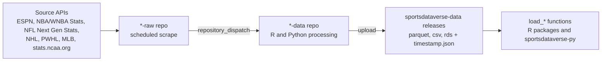

<!-- README.md is generated from README.Rmd. Edit README.Rmd, run rmarkdown::render("README.Rmd"), then run `npx --yes doctoc@2.5.0 README.md --github` to refill the table of contents. Rendering needs network access: every table is built from the nightly status snapshot in sportsdataverse/.github (status/producers.json, status/summary.json, status/ecosystem.json) and from this repository's releases, read live through the GitHub API. -->

# SportsDataverse Data 

<!-- badges: start -->

<!-- badges: end -->

This repository is the **release store** of the
[SportsDataverse](https://sportsdataverse.org): the `load_*()` functions
in the SportsDataverse R packages and in `sportsdataverse-py` read their
data from the GitHub releases published here (the nflverse-parity NFL
loaders read the nflverse-data releases instead). This page shows how
fresh each release is, which repository produces it, and whether the
pipelines behind it are passing.

Live status:
[sportsdataverse.org/status](https://sportsdataverse.org/status) ·
nightly snapshot:
[`status/ecosystem.md`](https://github.com/sportsdataverse/.github/blob/main/status/ecosystem.md)

<!-- START doctoc generated TOC please keep comment here to allow auto update -->
<!-- DON'T EDIT THIS SECTION, INSTEAD RE-RUN doctoc TO UPDATE -->

- [Data releases](#data-releases)
  - [Football](#football)
    - [College football (ESPN)](#college-football-espn)
    - [College football play-by-play (CollegeFootballData)](#college-football-play-by-play-collegefootballdata)
    - [College football (stats.ncaa.org)](#college-football-statsncaaorg)
    - [NFL (ESPN)](#nfl-espn)
    - [NFL Next Gen Stats](#nfl-next-gen-stats)
  - [Basketball](#basketball)
    - [Men’s college basketball (ESPN)](#mens-college-basketball-espn)
    - [Men’s college basketball (stats.ncaa.org)](#mens-college-basketball-statsncaaorg)
    - [NBA (ESPN)](#nba-espn)
    - [NBA Stats API](#nba-stats-api)
    - [Women’s college basketball (ESPN)](#womens-college-basketball-espn)
    - [Women’s college basketball (stats.ncaa.org)](#womens-college-basketball-statsncaaorg)
    - [WNBA (ESPN)](#wnba-espn)
    - [WNBA Stats API](#wnba-stats-api)
  - [Hockey](#hockey)
    - [NHL](#nhl)
    - [PWHL](#pwhl)
  - [Baseball](#baseball)
    - [MLB and college baseball](#mlb-and-college-baseball)
  - [Multi-sport reference](#multi-sport-reference)
    - [Conference, division and ballpark reference](#conference-division-and-ballpark-reference)
  - [Unattributed releases](#unattributed-releases)
- [Automation status](#automation-status)
  - [Football](#football-1)
  - [Basketball](#basketball-1)
  - [Hockey](#hockey-1)
  - [Baseball](#baseball-1)
  - [Multi-sport reference](#multi-sport-reference-1)
  - [Trigger workflows](#trigger-workflows)
  - [On-demand and annual workflows](#on-demand-and-annual-workflows)
  - [Package CI](#package-ci)
- [How to read the badges](#how-to-read-the-badges)
- [How the pipeline works](#how-the-pipeline-works)
- [Update schedule](#update-schedule)
- [Consuming the data](#consuming-the-data)
- [Dormant and archived datasets](#dormant-and-archived-datasets)
- [Repository layout](#repository-layout)

<!-- END doctoc generated TOC please keep comment here to allow auto update -->

## Data releases

Every processed dataset is a GitHub release of this repository, tagged
by dataset name and grouped below by sport and by the repository that
produces it. Above each table are that producer’s badges: its
**pipeline** state, when its play-by-play data was last **updated**, and
the latest season it runs **through** (see [How to read the
badges](#how-to-read-the-badges)).

In each table, **Last updated** reads the release’s `timestamp.json`
asset live; a release without one shows the date of its newest asset in
the nightly snapshot. **Through season** is the newest season in the
release’s asset names. Release tags with no data assets yet are listed
at the end.

### Football

#### College football (ESPN)

Produced by
[`cfbfastR-cfb-data`](https://github.com/sportsdataverse/cfbfastR-cfb-data)
from
[`cfbfastR-cfb-raw`](https://github.com/sportsdataverse/cfbfastR-cfb-raw).

| Release                                                                                                                                               | Last updated                                                                                                                                                                                                                                                      | Through season |
| :---------------------------------------------------------------------------------------------------------------------------------------------------- | :---------------------------------------------------------------------------------------------------------------------------------------------------------------------------------------------------------------------------------------------------------------- | :------------- |
| [`cfb_crosswalk`](https://github.com/sportsdataverse/sportsdataverse-data/releases/tag/cfb_crosswalk)                                                 | 2026-06-13 · newest asset                                                                                                                                                                                                                                         | 2025           |
| [`cfb_fpi_weekly`](https://github.com/sportsdataverse/sportsdataverse-data/releases/tag/cfb_fpi_weekly)                                               |                         | 2026           |
| [`cfb_league_averages`](https://github.com/sportsdataverse/sportsdataverse-data/releases/tag/cfb_league_averages)                                     |                    | 2026           |
| [`cfb_matchup_features`](https://github.com/sportsdataverse/sportsdataverse-data/releases/tag/cfb_matchup_features)                                   |                   | 2026           |
| [`cfb_matchup_line`](https://github.com/sportsdataverse/sportsdataverse-data/releases/tag/cfb_matchup_line)                                           |                       | 2026           |
| [`cfb_model_artifacts`](https://github.com/sportsdataverse/sportsdataverse-data/releases/tag/cfb_model_artifacts)                                     |                    | —              |
| [`cfb_ratings`](https://github.com/sportsdataverse/sportsdataverse-data/releases/tag/cfb_ratings)                                                     |                            | 2026           |
| [`cfb_ratings_weekly`](https://github.com/sportsdataverse/sportsdataverse-data/releases/tag/cfb_ratings_weekly)                                       |                     | 2026           |
| [`cfb_recruiting_proj`](https://github.com/sportsdataverse/sportsdataverse-data/releases/tag/cfb_recruiting_proj)                                     | 2026-08-06 · newest asset                                                                                                                                                                                                                                         | 2025           |
| [`cfb_recruits`](https://github.com/sportsdataverse/sportsdataverse-data/releases/tag/cfb_recruits)                                                   |                           | 2026           |
| [`cfb_returning_production`](https://github.com/sportsdataverse/sportsdataverse-data/releases/tag/cfb_returning_production)                           |               | 2026           |
| [`cfb_rolling_windows`](https://github.com/sportsdataverse/sportsdataverse-data/releases/tag/cfb_rolling_windows)                                     |                    | 2026           |
| [`cfb_schedules`](https://github.com/sportsdataverse/sportsdataverse-data/releases/tag/cfb_schedules)                                                 |                          | 2026           |
| [`cfb_team_info`](https://github.com/sportsdataverse/sportsdataverse-data/releases/tag/cfb_team_info)                                                 | 2026-08-27 · newest asset                                                                                                                                                                                                                                         | 2026           |
| [`cfb_team_opponent_splits`](https://github.com/sportsdataverse/sportsdataverse-data/releases/tag/cfb_team_opponent_splits)                           |               | 2026           |
| [`cfb_team_summaries_weekly`](https://github.com/sportsdataverse/sportsdataverse-data/releases/tag/cfb_team_summaries_weekly)                         |              | 2026           |
| [`cfb_team_talent`](https://github.com/sportsdataverse/sportsdataverse-data/releases/tag/cfb_team_talent)                                             |                        | 2026           |
| [`espn_cfb_adv_defensive`](https://github.com/sportsdataverse/sportsdataverse-data/releases/tag/espn_cfb_adv_defensive)                               |                 | 2026           |
| [`espn_cfb_adv_defensive_players`](https://github.com/sportsdataverse/sportsdataverse-data/releases/tag/espn_cfb_adv_defensive_players)               |         | 2026           |
| [`espn_cfb_adv_drive_scripting`](https://github.com/sportsdataverse/sportsdataverse-data/releases/tag/espn_cfb_adv_drive_scripting)                   |           | 2026           |
| [`espn_cfb_adv_drives`](https://github.com/sportsdataverse/sportsdataverse-data/releases/tag/espn_cfb_adv_drives)                                     |                    | 2026           |
| [`espn_cfb_adv_passing`](https://github.com/sportsdataverse/sportsdataverse-data/releases/tag/espn_cfb_adv_passing)                                   |                   | 2026           |
| [`espn_cfb_adv_player_usage`](https://github.com/sportsdataverse/sportsdataverse-data/releases/tag/espn_cfb_adv_player_usage)                         |              | 2026           |
| [`espn_cfb_adv_position_group_tackles`](https://github.com/sportsdataverse/sportsdataverse-data/releases/tag/espn_cfb_adv_position_group_tackles)     |    | 2026           |
| [`espn_cfb_adv_position_group_usage`](https://github.com/sportsdataverse/sportsdataverse-data/releases/tag/espn_cfb_adv_position_group_usage)         |      | 2026           |
| [`espn_cfb_adv_receiving`](https://github.com/sportsdataverse/sportsdataverse-data/releases/tag/espn_cfb_adv_receiving)                               |                 | 2026           |
| [`espn_cfb_adv_rushing`](https://github.com/sportsdataverse/sportsdataverse-data/releases/tag/espn_cfb_adv_rushing)                                   |                   | 2026           |
| [`espn_cfb_adv_situational`](https://github.com/sportsdataverse/sportsdataverse-data/releases/tag/espn_cfb_adv_situational)                           |               | 2026           |
| [`espn_cfb_adv_specialists`](https://github.com/sportsdataverse/sportsdataverse-data/releases/tag/espn_cfb_adv_specialists)                           |               | 2026           |
| [`espn_cfb_adv_st_blocks`](https://github.com/sportsdataverse/sportsdataverse-data/releases/tag/espn_cfb_adv_st_blocks)                               |                 | 2026           |
| [`espn_cfb_adv_st_kickers`](https://github.com/sportsdataverse/sportsdataverse-data/releases/tag/espn_cfb_adv_st_kickers)                             |                | 2026           |
| [`espn_cfb_adv_st_punters`](https://github.com/sportsdataverse/sportsdataverse-data/releases/tag/espn_cfb_adv_st_punters)                             |                | 2026           |
| [`espn_cfb_adv_st_returners`](https://github.com/sportsdataverse/sportsdataverse-data/releases/tag/espn_cfb_adv_st_returners)                         |              | 2026           |
| [`espn_cfb_adv_st_team`](https://github.com/sportsdataverse/sportsdataverse-data/releases/tag/espn_cfb_adv_st_team)                                   |                   | 2026           |
| [`espn_cfb_adv_tackles`](https://github.com/sportsdataverse/sportsdataverse-data/releases/tag/espn_cfb_adv_tackles)                                   |                   | 2026           |
| [`espn_cfb_adv_team`](https://github.com/sportsdataverse/sportsdataverse-data/releases/tag/espn_cfb_adv_team)                                         |                      | 2026           |
| [`espn_cfb_adv_team_gamelog`](https://github.com/sportsdataverse/sportsdataverse-data/releases/tag/espn_cfb_adv_team_gamelog)                         |              | 2026           |
| [`espn_cfb_adv_team_usage`](https://github.com/sportsdataverse/sportsdataverse-data/releases/tag/espn_cfb_adv_team_usage)                             |                | 2026           |
| [`espn_cfb_adv_turnover`](https://github.com/sportsdataverse/sportsdataverse-data/releases/tag/espn_cfb_adv_turnover)                                 |                  | 2026           |
| [`espn_cfb_betting`](https://github.com/sportsdataverse/sportsdataverse-data/releases/tag/espn_cfb_betting)                                           |                       | 2026           |
| [`espn_cfb_coach_careers`](https://github.com/sportsdataverse/sportsdataverse-data/releases/tag/espn_cfb_coach_careers)                               |                 | —              |
| [`espn_cfb_coach_tendencies`](https://github.com/sportsdataverse/sportsdataverse-data/releases/tag/espn_cfb_coach_tendencies)                         |              | 2026           |
| [`espn_cfb_drives`](https://github.com/sportsdataverse/sportsdataverse-data/releases/tag/espn_cfb_drives)                                             |                        | 2026           |
| [`espn_cfb_game_rosters`](https://github.com/sportsdataverse/sportsdataverse-data/releases/tag/espn_cfb_game_rosters)                                 |                  | 2026           |
| [`espn_cfb_injuries`](https://github.com/sportsdataverse/sportsdataverse-data/releases/tag/espn_cfb_injuries)                                         |                      | 2026           |
| [`espn_cfb_linescores`](https://github.com/sportsdataverse/sportsdataverse-data/releases/tag/espn_cfb_linescores)                                     |                    | 2026           |
| [`espn_cfb_model_artifacts`](https://github.com/sportsdataverse/sportsdataverse-data/releases/tag/espn_cfb_model_artifacts)                           |               | —              |
| [`espn_cfb_model_pbp`](https://github.com/sportsdataverse/sportsdataverse-data/releases/tag/espn_cfb_model_pbp)                                       | 2026-09-02 · newest asset                                                                                                                                                                                                                                         | 2025           |
| [`espn_cfb_passing`](https://github.com/sportsdataverse/sportsdataverse-data/releases/tag/espn_cfb_passing)                                           |                       | 2026           |
| [`espn_cfb_pbp`](https://github.com/sportsdataverse/sportsdataverse-data/releases/tag/espn_cfb_pbp)                                                   |                           | 2026           |
| [`espn_cfb_percentiles`](https://github.com/sportsdataverse/sportsdataverse-data/releases/tag/espn_cfb_percentiles)                                   |                   | 2026           |
| [`espn_cfb_play_participants`](https://github.com/sportsdataverse/sportsdataverse-data/releases/tag/espn_cfb_play_participants)                       |             | 2026           |
| [`espn_cfb_player_box`](https://github.com/sportsdataverse/sportsdataverse-data/releases/tag/espn_cfb_player_box)                                     |                    | 2026           |
| [`espn_cfb_power_index`](https://github.com/sportsdataverse/sportsdataverse-data/releases/tag/espn_cfb_power_index)                                   |                   | 2026           |
| [`espn_cfb_qa`](https://github.com/sportsdataverse/sportsdataverse-data/releases/tag/espn_cfb_qa)                                                     |                            | 2026           |
| [`espn_cfb_receiving`](https://github.com/sportsdataverse/sportsdataverse-data/releases/tag/espn_cfb_receiving)                                       |                     | 2026           |
| [`espn_cfb_rosters`](https://github.com/sportsdataverse/sportsdataverse-data/releases/tag/espn_cfb_rosters)                                           |                       | 2026           |
| [`espn_cfb_rushing`](https://github.com/sportsdataverse/sportsdataverse-data/releases/tag/espn_cfb_rushing)                                           |                       | 2026           |
| [`espn_cfb_schedules`](https://github.com/sportsdataverse/sportsdataverse-data/releases/tag/espn_cfb_schedules)                                       |                     | 2026           |
| [`espn_cfb_team_box`](https://github.com/sportsdataverse/sportsdataverse-data/releases/tag/espn_cfb_team_box)                                         |                      | 2026           |
| [`espn_cfb_team_summaries`](https://github.com/sportsdataverse/sportsdataverse-data/releases/tag/espn_cfb_team_summaries)                             |                | 2026           |
| [`espn_cfb_team_tendencies`](https://github.com/sportsdataverse/sportsdataverse-data/releases/tag/espn_cfb_team_tendencies)                           |               | 2026           |
| [`espn_cfb_teams`](https://github.com/sportsdataverse/sportsdataverse-data/releases/tag/espn_cfb_teams)                                               | 2026-08-27 · newest asset                                                                                                                                                                                                                                         | 2026           |
| [`espn_cfb_usage_drive_scripting`](https://github.com/sportsdataverse/sportsdataverse-data/releases/tag/espn_cfb_usage_drive_scripting)               |         | 2026           |
| [`espn_cfb_usage_players`](https://github.com/sportsdataverse/sportsdataverse-data/releases/tag/espn_cfb_usage_players)                               |                 | 2026           |
| [`espn_cfb_usage_position_group_tackles`](https://github.com/sportsdataverse/sportsdataverse-data/releases/tag/espn_cfb_usage_position_group_tackles) |  | 2026           |
| [`espn_cfb_usage_position_groups`](https://github.com/sportsdataverse/sportsdataverse-data/releases/tag/espn_cfb_usage_position_groups)               |         | 2026           |
| [`espn_cfb_usage_st_blocks`](https://github.com/sportsdataverse/sportsdataverse-data/releases/tag/espn_cfb_usage_st_blocks)                           |               | 2026           |
| [`espn_cfb_usage_st_kickers`](https://github.com/sportsdataverse/sportsdataverse-data/releases/tag/espn_cfb_usage_st_kickers)                         |              | 2026           |
| [`espn_cfb_usage_st_punters`](https://github.com/sportsdataverse/sportsdataverse-data/releases/tag/espn_cfb_usage_st_punters)                         |              | 2026           |
| [`espn_cfb_usage_st_returners`](https://github.com/sportsdataverse/sportsdataverse-data/releases/tag/espn_cfb_usage_st_returners)                     |            | 2026           |
| [`espn_cfb_usage_st_team`](https://github.com/sportsdataverse/sportsdataverse-data/releases/tag/espn_cfb_usage_st_team)                               |                 | 2026           |
| [`espn_cfb_usage_tackles`](https://github.com/sportsdataverse/sportsdataverse-data/releases/tag/espn_cfb_usage_tackles)                               |                 | 2026           |
| [`espn_cfb_usage_teams`](https://github.com/sportsdataverse/sportsdataverse-data/releases/tag/espn_cfb_usage_teams)                                   |                   | 2026           |
| [`espn_mlb_depthcharts`](https://github.com/sportsdataverse/sportsdataverse-data/releases/tag/espn_mlb_depthcharts)                                   |                   | 2026           |
| [`espn_mlb_injuries`](https://github.com/sportsdataverse/sportsdataverse-data/releases/tag/espn_mlb_injuries)                                         |                      | 2026           |
| [`espn_nba_depthcharts`](https://github.com/sportsdataverse/sportsdataverse-data/releases/tag/espn_nba_depthcharts)                                   |                   | 2027           |
| [`espn_nba_injuries`](https://github.com/sportsdataverse/sportsdataverse-data/releases/tag/espn_nba_injuries)                                         |                      | 2027           |
| [`espn_nfl_depthcharts`](https://github.com/sportsdataverse/sportsdataverse-data/releases/tag/espn_nfl_depthcharts)                                   |                   | 2026           |
| [`espn_nfl_injuries`](https://github.com/sportsdataverse/sportsdataverse-data/releases/tag/espn_nfl_injuries)                                         |                      | 2026           |
| [`espn_nhl_injuries`](https://github.com/sportsdataverse/sportsdataverse-data/releases/tag/espn_nhl_injuries)                                         |                      | 2027           |
| [`espn_wnba_injuries`](https://github.com/sportsdataverse/sportsdataverse-data/releases/tag/espn_wnba_injuries)                                       |                     | 2026           |

#### College football play-by-play (CollegeFootballData)

Produced by
[`cfbfastR-data`](https://github.com/sportsdataverse/cfbfastR-data).

| Release                                                                                                     | Last updated                                                                                                                                                                                                                                 | Through season |
| :---------------------------------------------------------------------------------------------------------- | :------------------------------------------------------------------------------------------------------------------------------------------------------------------------------------------------------------------------------------------- | :------------- |
| [`cfbfastR_cfb_pbp`](https://github.com/sportsdataverse/sportsdataverse-data/releases/tag/cfbfastR_cfb_pbp) |  | 2026           |

#### College football (stats.ncaa.org)

Produced by
[`ncaa-mfb-football-data`](https://github.com/sportsdataverse/ncaa-mfb-football-data)
from
[`ncaa-mfb-football-raw`](https://github.com/sportsdataverse/ncaa-mfb-football-raw).

| Release                                                                                                               | Last updated                                                                                                                                                                                                                                      | Through season |
| :-------------------------------------------------------------------------------------------------------------------- | :------------------------------------------------------------------------------------------------------------------------------------------------------------------------------------------------------------------------------------------------ | :------------- |
| [`ncaa_mfb_drives`](https://github.com/sportsdataverse/sportsdataverse-data/releases/tag/ncaa_mfb_drives)             |        | 2026           |
| [`ncaa_mfb_linescore`](https://github.com/sportsdataverse/sportsdataverse-data/releases/tag/ncaa_mfb_linescore)       |     | 2026           |
| [`ncaa_mfb_officials`](https://github.com/sportsdataverse/sportsdataverse-data/releases/tag/ncaa_mfb_officials)       |     | 2026           |
| [`ncaa_mfb_pbp`](https://github.com/sportsdataverse/sportsdataverse-data/releases/tag/ncaa_mfb_pbp)                   |           | 2026           |
| [`ncaa_mfb_pbp_cfbfastr`](https://github.com/sportsdataverse/sportsdataverse-data/releases/tag/ncaa_mfb_pbp_cfbfastr) |  | 2026           |
| [`ncaa_mfb_player_stats`](https://github.com/sportsdataverse/sportsdataverse-data/releases/tag/ncaa_mfb_player_stats) |  | 2026           |
| [`ncaa_mfb_qa`](https://github.com/sportsdataverse/sportsdataverse-data/releases/tag/ncaa_mfb_qa)                     |            | 2026           |
| [`ncaa_mfb_rosters`](https://github.com/sportsdataverse/sportsdataverse-data/releases/tag/ncaa_mfb_rosters)           |       | 2026           |
| [`ncaa_mfb_schedule`](https://github.com/sportsdataverse/sportsdataverse-data/releases/tag/ncaa_mfb_schedule)         |      | 2026           |
| [`ncaa_mfb_team_stats`](https://github.com/sportsdataverse/sportsdataverse-data/releases/tag/ncaa_mfb_team_stats)     |    | 2026           |
| [`ncaa_mfb_teams`](https://github.com/sportsdataverse/sportsdataverse-data/releases/tag/ncaa_mfb_teams)               |         | 2026           |

#### NFL (ESPN)

Produced by [`nfl-data`](https://github.com/sportsdataverse/nfl-data)
from [`nfl-raw`](https://github.com/sportsdataverse/nfl-raw).

| Release                                                                                                                                               | Last updated                                                                                                                                                                                                                                         | Through season |
| :---------------------------------------------------------------------------------------------------------------------------------------------------- | :--------------------------------------------------------------------------------------------------------------------------------------------------------------------------------------------------------------------------------------------------- | :------------- |
| [`espn_nfl_adv_defensive`](https://github.com/sportsdataverse/sportsdataverse-data/releases/tag/espn_nfl_adv_defensive)                               | 2026-09-29 · newest asset                                                                                                                                                                                                                            | 2026           |
| [`espn_nfl_adv_defensive_players`](https://github.com/sportsdataverse/sportsdataverse-data/releases/tag/espn_nfl_adv_defensive_players)               | 2026-09-29 · newest asset                                                                                                                                                                                                                            | 2026           |
| [`espn_nfl_adv_drive_scripting`](https://github.com/sportsdataverse/sportsdataverse-data/releases/tag/espn_nfl_adv_drive_scripting)                   | 2026-09-29 · newest asset                                                                                                                                                                                                                            | 2026           |
| [`espn_nfl_adv_drives`](https://github.com/sportsdataverse/sportsdataverse-data/releases/tag/espn_nfl_adv_drives)                                     | 2026-09-29 · newest asset                                                                                                                                                                                                                            | 2026           |
| [`espn_nfl_adv_passing`](https://github.com/sportsdataverse/sportsdataverse-data/releases/tag/espn_nfl_adv_passing)                                   | 2026-09-29 · newest asset                                                                                                                                                                                                                            | 2026           |
| [`espn_nfl_adv_player_usage`](https://github.com/sportsdataverse/sportsdataverse-data/releases/tag/espn_nfl_adv_player_usage)                         | 2026-09-29 · newest asset                                                                                                                                                                                                                            | 2026           |
| [`espn_nfl_adv_position_group_tackles`](https://github.com/sportsdataverse/sportsdataverse-data/releases/tag/espn_nfl_adv_position_group_tackles)     | 2026-09-29 · newest asset                                                                                                                                                                                                                            | 2026           |
| [`espn_nfl_adv_position_group_usage`](https://github.com/sportsdataverse/sportsdataverse-data/releases/tag/espn_nfl_adv_position_group_usage)         | 2026-09-29 · newest asset                                                                                                                                                                                                                            | 2026           |
| [`espn_nfl_adv_receiving`](https://github.com/sportsdataverse/sportsdataverse-data/releases/tag/espn_nfl_adv_receiving)                               | 2026-09-29 · newest asset                                                                                                                                                                                                                            | 2026           |
| [`espn_nfl_adv_rushing`](https://github.com/sportsdataverse/sportsdataverse-data/releases/tag/espn_nfl_adv_rushing)                                   | 2026-09-29 · newest asset                                                                                                                                                                                                                            | 2026           |
| [`espn_nfl_adv_situational`](https://github.com/sportsdataverse/sportsdataverse-data/releases/tag/espn_nfl_adv_situational)                           | 2026-09-29 · newest asset                                                                                                                                                                                                                            | 2026           |
| [`espn_nfl_adv_specialists`](https://github.com/sportsdataverse/sportsdataverse-data/releases/tag/espn_nfl_adv_specialists)                           | 2026-09-29 · newest asset                                                                                                                                                                                                                            | 2026           |
| [`espn_nfl_adv_st_blocks`](https://github.com/sportsdataverse/sportsdataverse-data/releases/tag/espn_nfl_adv_st_blocks)                               | 2026-09-29 · newest asset                                                                                                                                                                                                                            | 2026           |
| [`espn_nfl_adv_st_kickers`](https://github.com/sportsdataverse/sportsdataverse-data/releases/tag/espn_nfl_adv_st_kickers)                             | 2026-09-29 · newest asset                                                                                                                                                                                                                            | 2026           |
| [`espn_nfl_adv_st_punters`](https://github.com/sportsdataverse/sportsdataverse-data/releases/tag/espn_nfl_adv_st_punters)                             | 2026-09-29 · newest asset                                                                                                                                                                                                                            | 2026           |
| [`espn_nfl_adv_st_returners`](https://github.com/sportsdataverse/sportsdataverse-data/releases/tag/espn_nfl_adv_st_returners)                         | 2026-09-29 · newest asset                                                                                                                                                                                                                            | 2026           |
| [`espn_nfl_adv_st_team`](https://github.com/sportsdataverse/sportsdataverse-data/releases/tag/espn_nfl_adv_st_team)                                   | 2026-09-29 · newest asset                                                                                                                                                                                                                            | 2026           |
| [`espn_nfl_adv_tackles`](https://github.com/sportsdataverse/sportsdataverse-data/releases/tag/espn_nfl_adv_tackles)                                   | 2026-09-29 · newest asset                                                                                                                                                                                                                            | 2026           |
| [`espn_nfl_adv_team`](https://github.com/sportsdataverse/sportsdataverse-data/releases/tag/espn_nfl_adv_team)                                         | 2026-09-29 · newest asset                                                                                                                                                                                                                            | 2026           |
| [`espn_nfl_adv_team_usage`](https://github.com/sportsdataverse/sportsdataverse-data/releases/tag/espn_nfl_adv_team_usage)                             | 2026-09-29 · newest asset                                                                                                                                                                                                                            | 2026           |
| [`espn_nfl_adv_turnover`](https://github.com/sportsdataverse/sportsdataverse-data/releases/tag/espn_nfl_adv_turnover)                                 | 2026-09-29 · newest asset                                                                                                                                                                                                                            | 2026           |
| [`espn_nfl_coach_careers`](https://github.com/sportsdataverse/sportsdataverse-data/releases/tag/espn_nfl_coach_careers)                               | 2026-09-29 · newest asset                                                                                                                                                                                                                            | —              |
| [`espn_nfl_coach_tendencies`](https://github.com/sportsdataverse/sportsdataverse-data/releases/tag/espn_nfl_coach_tendencies)                         | 2026-09-29 · newest asset                                                                                                                                                                                                                            | 2026           |
| [`espn_nfl_drives`](https://github.com/sportsdataverse/sportsdataverse-data/releases/tag/espn_nfl_drives)                                             | 2026-09-29 · newest asset                                                                                                                                                                                                                            | 2026           |
| [`espn_nfl_pbp`](https://github.com/sportsdataverse/sportsdataverse-data/releases/tag/espn_nfl_pbp)                                                   | 2026-09-29 · newest asset                                                                                                                                                                                                                            | 2026           |
| [`espn_nfl_play_participants`](https://github.com/sportsdataverse/sportsdataverse-data/releases/tag/espn_nfl_play_participants)                       | 2026-09-29 · newest asset                                                                                                                                                                                                                            | 2026           |
| [`espn_nfl_player_box`](https://github.com/sportsdataverse/sportsdataverse-data/releases/tag/espn_nfl_player_box)                                     | 2026-09-29 · newest asset                                                                                                                                                                                                                            | 2026           |
| [`espn_nfl_qa`](https://github.com/sportsdataverse/sportsdataverse-data/releases/tag/espn_nfl_qa)                                                     | 2026-09-29 · newest asset                                                                                                                                                                                                                            | 2026           |
| [`espn_nfl_team_box`](https://github.com/sportsdataverse/sportsdataverse-data/releases/tag/espn_nfl_team_box)                                         | 2026-09-29 · newest asset                                                                                                                                                                                                                            | 2026           |
| [`espn_nfl_team_tendencies`](https://github.com/sportsdataverse/sportsdataverse-data/releases/tag/espn_nfl_team_tendencies)                           | 2026-09-29 · newest asset                                                                                                                                                                                                                            | 2026           |
| [`espn_nfl_usage_drive_scripting`](https://github.com/sportsdataverse/sportsdataverse-data/releases/tag/espn_nfl_usage_drive_scripting)               | 2026-09-29 · newest asset                                                                                                                                                                                                                            | 2026           |
| [`espn_nfl_usage_players`](https://github.com/sportsdataverse/sportsdataverse-data/releases/tag/espn_nfl_usage_players)                               | 2026-09-29 · newest asset                                                                                                                                                                                                                            | 2026           |
| [`espn_nfl_usage_position_group_tackles`](https://github.com/sportsdataverse/sportsdataverse-data/releases/tag/espn_nfl_usage_position_group_tackles) | 2026-09-29 · newest asset                                                                                                                                                                                                                            | 2026           |
| [`espn_nfl_usage_position_groups`](https://github.com/sportsdataverse/sportsdataverse-data/releases/tag/espn_nfl_usage_position_groups)               | 2026-09-29 · newest asset                                                                                                                                                                                                                            | 2026           |
| [`espn_nfl_usage_st_blocks`](https://github.com/sportsdataverse/sportsdataverse-data/releases/tag/espn_nfl_usage_st_blocks)                           | 2026-09-29 · newest asset                                                                                                                                                                                                                            | 2026           |
| [`espn_nfl_usage_st_kickers`](https://github.com/sportsdataverse/sportsdataverse-data/releases/tag/espn_nfl_usage_st_kickers)                         | 2026-09-29 · newest asset                                                                                                                                                                                                                            | 2026           |
| [`espn_nfl_usage_st_punters`](https://github.com/sportsdataverse/sportsdataverse-data/releases/tag/espn_nfl_usage_st_punters)                         | 2026-09-29 · newest asset                                                                                                                                                                                                                            | 2026           |
| [`espn_nfl_usage_st_returners`](https://github.com/sportsdataverse/sportsdataverse-data/releases/tag/espn_nfl_usage_st_returners)                     | 2026-09-29 · newest asset                                                                                                                                                                                                                            | 2026           |
| [`espn_nfl_usage_st_team`](https://github.com/sportsdataverse/sportsdataverse-data/releases/tag/espn_nfl_usage_st_team)                               | 2026-09-29 · newest asset                                                                                                                                                                                                                            | 2026           |
| [`espn_nfl_usage_tackles`](https://github.com/sportsdataverse/sportsdataverse-data/releases/tag/espn_nfl_usage_tackles)                               | 2026-09-29 · newest asset                                                                                                                                                                                                                            | 2026           |
| [`espn_nfl_usage_teams`](https://github.com/sportsdataverse/sportsdataverse-data/releases/tag/espn_nfl_usage_teams)                                   | 2026-09-29 · newest asset                                                                                                                                                                                                                            | 2026           |
| [`nfl_4th_down_models`](https://github.com/sportsdataverse/sportsdataverse-data/releases/tag/nfl_4th_down_models)                                     |       | —              |
| [`nfl_espn_qbr`](https://github.com/sportsdataverse/sportsdataverse-data/releases/tag/nfl_espn_qbr)                                                   |              | —              |
| [`nfl_league_averages`](https://github.com/sportsdataverse/sportsdataverse-data/releases/tag/nfl_league_averages)                                     |       | 2026           |
| [`nfl_model_artifacts`](https://github.com/sportsdataverse/sportsdataverse-data/releases/tag/nfl_model_artifacts)                                     |       | —              |
| [`nfl_model_pbp`](https://github.com/sportsdataverse/sportsdataverse-data/releases/tag/nfl_model_pbp)                                                 |             | 2026           |
| [`nfl_passing`](https://github.com/sportsdataverse/sportsdataverse-data/releases/tag/nfl_passing)                                                     |               | 2026           |
| [`nfl_percentiles`](https://github.com/sportsdataverse/sportsdataverse-data/releases/tag/nfl_percentiles)                                             |           | 2026           |
| [`nfl_player_percentiles`](https://github.com/sportsdataverse/sportsdataverse-data/releases/tag/nfl_player_percentiles)                               |    | 2026           |
| [`nfl_player_stats`](https://github.com/sportsdataverse/sportsdataverse-data/releases/tag/nfl_player_stats)                                           |          | —              |
| [`nfl_players`](https://github.com/sportsdataverse/sportsdataverse-data/releases/tag/nfl_players)                                                     |               | —              |
| [`nfl_ratings_weekly`](https://github.com/sportsdataverse/sportsdataverse-data/releases/tag/nfl_ratings_weekly)                                       |        | 2026           |
| [`nfl_receiving`](https://github.com/sportsdataverse/sportsdataverse-data/releases/tag/nfl_receiving)                                                 |             | 2026           |
| [`nfl_rolling_windows`](https://github.com/sportsdataverse/sportsdataverse-data/releases/tag/nfl_rolling_windows)                                     | 2026-09-29 · newest asset                                                                                                                                                                                                                            | 2026           |
| [`nfl_rosters`](https://github.com/sportsdataverse/sportsdataverse-data/releases/tag/nfl_rosters)                                                     |               | 2026           |
| [`nfl_rushing`](https://github.com/sportsdataverse/sportsdataverse-data/releases/tag/nfl_rushing)                                                     |               | 2026           |
| [`nfl_team_opponent_splits`](https://github.com/sportsdataverse/sportsdataverse-data/releases/tag/nfl_team_opponent_splits)                           |  | 2026           |
| [`nfl_team_stats`](https://github.com/sportsdataverse/sportsdataverse-data/releases/tag/nfl_team_stats)                                               |            | —              |
| [`nfl_team_summaries`](https://github.com/sportsdataverse/sportsdataverse-data/releases/tag/nfl_team_summaries)                                       |        | 2026           |

#### NFL Next Gen Stats

Produced by
[`nfl-ngs-data`](https://github.com/sportsdataverse/nfl-ngs-data) from
[`nfl-ngs-raw`](https://github.com/sportsdataverse/nfl-ngs-raw).

| Release                                                                                                                                   | Last updated                                                                                                                                                                                                                                                | Through season |
| :---------------------------------------------------------------------------------------------------------------------------------------- | :---------------------------------------------------------------------------------------------------------------------------------------------------------------------------------------------------------------------------------------------------------- | :------------- |
| [`nfl_ngs_gamecenter_leaders`](https://github.com/sportsdataverse/sportsdataverse-data/releases/tag/nfl_ngs_gamecenter_leaders)           |       | 2026           |
| [`nfl_ngs_gamecenter_pass_rushers`](https://github.com/sportsdataverse/sportsdataverse-data/releases/tag/nfl_ngs_gamecenter_pass_rushers) |  | 2026           |
| [`nfl_ngs_gamecenter_passers`](https://github.com/sportsdataverse/sportsdataverse-data/releases/tag/nfl_ngs_gamecenter_passers)           |       | 2026           |
| [`nfl_ngs_gamecenter_receivers`](https://github.com/sportsdataverse/sportsdataverse-data/releases/tag/nfl_ngs_gamecenter_receivers)       |     | 2026           |
| [`nfl_ngs_gamecenter_rushers`](https://github.com/sportsdataverse/sportsdataverse-data/releases/tag/nfl_ngs_gamecenter_rushers)           |       | 2026           |
| [`nfl_ngs_highlight_events`](https://github.com/sportsdataverse/sportsdataverse-data/releases/tag/nfl_ngs_highlight_events)               |         | 2026           |
| [`nfl_ngs_highlight_participation`](https://github.com/sportsdataverse/sportsdataverse-data/releases/tag/nfl_ngs_highlight_participation) |  | 2026           |
| [`nfl_ngs_highlight_tracking`](https://github.com/sportsdataverse/sportsdataverse-data/releases/tag/nfl_ngs_highlight_tracking)           |       | 2026           |
| [`nfl_ngs_highlights`](https://github.com/sportsdataverse/sportsdataverse-data/releases/tag/nfl_ngs_highlights)                           |               | 2026           |
| [`nfl_ngs_leaders`](https://github.com/sportsdataverse/sportsdataverse-data/releases/tag/nfl_ngs_leaders)                                 |                  | 2026           |
| [`nfl_ngs_passing`](https://github.com/sportsdataverse/sportsdataverse-data/releases/tag/nfl_ngs_passing)                                 |                  | 2026           |
| [`nfl_ngs_receiving`](https://github.com/sportsdataverse/sportsdataverse-data/releases/tag/nfl_ngs_receiving)                             |                | 2026           |
| [`nfl_ngs_rushing`](https://github.com/sportsdataverse/sportsdataverse-data/releases/tag/nfl_ngs_rushing)                                 |                  | 2026           |
| [`nfl_ngs_schedules`](https://github.com/sportsdataverse/sportsdataverse-data/releases/tag/nfl_ngs_schedules)                             |                | 2026           |
| [`nfl_ngs_statboard_leaders`](https://github.com/sportsdataverse/sportsdataverse-data/releases/tag/nfl_ngs_statboard_leaders)             |        | 2026           |
| [`nfl_ngs_teams`](https://github.com/sportsdataverse/sportsdataverse-data/releases/tag/nfl_ngs_teams)                                     |                    | 2026           |

### Basketball

#### Men’s college basketball (ESPN)

Produced by
[`hoopR-mbb-data`](https://github.com/sportsdataverse/hoopR-mbb-data)
from
[`hoopR-mbb-raw`](https://github.com/sportsdataverse/hoopR-mbb-raw).

| Release                                                                                                                                                                     | Last updated                                                                                                                                                                                                                                                                 | Through season |
| :-------------------------------------------------------------------------------------------------------------------------------------------------------------------------- | :--------------------------------------------------------------------------------------------------------------------------------------------------------------------------------------------------------------------------------------------------------------------------- | :------------- |
| [`espn_mens_college_basketball_game_rosters`](https://github.com/sportsdataverse/sportsdataverse-data/releases/tag/espn_mens_college_basketball_game_rosters)               |         | 2026           |
| [`espn_mens_college_basketball_officials`](https://github.com/sportsdataverse/sportsdataverse-data/releases/tag/espn_mens_college_basketball_officials)                     |            | 2026           |
| [`espn_mens_college_basketball_pbp`](https://github.com/sportsdataverse/sportsdataverse-data/releases/tag/espn_mens_college_basketball_pbp)                                 |                  | 2026           |
| [`espn_mens_college_basketball_player_boxscores`](https://github.com/sportsdataverse/sportsdataverse-data/releases/tag/espn_mens_college_basketball_player_boxscores)       |     | 2026           |
| [`espn_mens_college_basketball_player_core`](https://github.com/sportsdataverse/sportsdataverse-data/releases/tag/espn_mens_college_basketball_player_core)                 | 2026-09-01 · newest asset                                                                                                                                                                                                                                                    | 2026           |
| [`espn_mens_college_basketball_player_season_stats`](https://github.com/sportsdataverse/sportsdataverse-data/releases/tag/espn_mens_college_basketball_player_season_stats) |  | 2026           |
| [`espn_mens_college_basketball_rosters`](https://github.com/sportsdataverse/sportsdataverse-data/releases/tag/espn_mens_college_basketball_rosters)                         |              | 2027           |
| [`espn_mens_college_basketball_schedules`](https://github.com/sportsdataverse/sportsdataverse-data/releases/tag/espn_mens_college_basketball_schedules)                     |            | 2027           |
| [`espn_mens_college_basketball_shots`](https://github.com/sportsdataverse/sportsdataverse-data/releases/tag/espn_mens_college_basketball_shots)                             |                | 2026           |
| [`espn_mens_college_basketball_standings`](https://github.com/sportsdataverse/sportsdataverse-data/releases/tag/espn_mens_college_basketball_standings)                     |            | 2026           |
| [`espn_mens_college_basketball_team_boxscores`](https://github.com/sportsdataverse/sportsdataverse-data/releases/tag/espn_mens_college_basketball_team_boxscores)           |       | 2026           |
| [`espn_mens_college_basketball_team_season_stats`](https://github.com/sportsdataverse/sportsdataverse-data/releases/tag/espn_mens_college_basketball_team_season_stats)     |    | 2026           |
| [`mbb_crosswalk`](https://github.com/sportsdataverse/sportsdataverse-data/releases/tag/mbb_crosswalk)                                                                       |                                     | 2026           |
| [`mbb_player_value`](https://github.com/sportsdataverse/sportsdataverse-data/releases/tag/mbb_player_value)                                                                 |                                  | 2026           |
| [`mbb_ratings`](https://github.com/sportsdataverse/sportsdataverse-data/releases/tag/mbb_ratings)                                                                           |                                       | 2026           |

#### Men’s college basketball (stats.ncaa.org)

Produced by
[`ncaa-mbb-hoops-data`](https://github.com/sportsdataverse/ncaa-mbb-hoops-data)
from
[`ncaa-mbb-hoops-raw`](https://github.com/sportsdataverse/ncaa-mbb-hoops-raw).

| Release                                                                                                                       | Last updated                                                                                                                                                                                                                                          | Through season |
| :---------------------------------------------------------------------------------------------------------------------------- | :---------------------------------------------------------------------------------------------------------------------------------------------------------------------------------------------------------------------------------------------------- | :------------- |
| [`ncaa_mbb_lineups`](https://github.com/sportsdataverse/sportsdataverse-data/releases/tag/ncaa_mbb_lineups)                   | 2026-08-20 · newest asset                                                                                                                                                                                                                             | 2026           |
| [`ncaa_mbb_matchup_stints`](https://github.com/sportsdataverse/sportsdataverse-data/releases/tag/ncaa_mbb_matchup_stints)     | 2026-08-20 · newest asset                                                                                                                                                                                                                             | 2026           |
| [`ncaa_mbb_pbp`](https://github.com/sportsdataverse/sportsdataverse-data/releases/tag/ncaa_mbb_pbp)                           | 2026-08-12 · newest asset                                                                                                                                                                                                                             | 2026           |
| [`ncaa_mbb_player_box`](https://github.com/sportsdataverse/sportsdataverse-data/releases/tag/ncaa_mbb_player_box)             | 2026-08-12 · newest asset                                                                                                                                                                                                                             | 2026           |
| [`ncaa_mbb_possessions`](https://github.com/sportsdataverse/sportsdataverse-data/releases/tag/ncaa_mbb_possessions)           | 2026-08-12 · newest asset                                                                                                                                                                                                                             | 2026           |
| [`ncaa_mbb_rapm`](https://github.com/sportsdataverse/sportsdataverse-data/releases/tag/ncaa_mbb_rapm)                         |              | 2026           |
| [`ncaa_mbb_rapm_within_team`](https://github.com/sportsdataverse/sportsdataverse-data/releases/tag/ncaa_mbb_rapm_within_team) |  | 2026           |
| [`ncaa_mbb_rosters`](https://github.com/sportsdataverse/sportsdataverse-data/releases/tag/ncaa_mbb_rosters)                   | 2026-08-12 · newest asset                                                                                                                                                                                                                             | 2026           |
| [`ncaa_mbb_schedule`](https://github.com/sportsdataverse/sportsdataverse-data/releases/tag/ncaa_mbb_schedule)                 | 2026-08-12 · newest asset                                                                                                                                                                                                                             | 2026           |
| [`ncaa_mbb_shots`](https://github.com/sportsdataverse/sportsdataverse-data/releases/tag/ncaa_mbb_shots)                       | 2026-08-20 · newest asset                                                                                                                                                                                                                             | 2026           |
| [`ncaa_mbb_team_box`](https://github.com/sportsdataverse/sportsdataverse-data/releases/tag/ncaa_mbb_team_box)                 | 2026-08-12 · newest asset                                                                                                                                                                                                                             | 2026           |
| [`ncaa_mbb_team_ids`](https://github.com/sportsdataverse/sportsdataverse-data/releases/tag/ncaa_mbb_team_ids)                 | 2026-08-12 · newest asset                                                                                                                                                                                                                             | 2026           |
| [`ncaa_mbb_team_rosters`](https://github.com/sportsdataverse/sportsdataverse-data/releases/tag/ncaa_mbb_team_rosters)         | 2026-08-12 · newest asset                                                                                                                                                                                                                             | 2026           |

#### NBA (ESPN)

Produced by
[`hoopR-nba-data`](https://github.com/sportsdataverse/hoopR-nba-data)
from
[`hoopR-nba-raw`](https://github.com/sportsdataverse/hoopR-nba-raw).

| Release                                                                                                                             | Last updated                                                                                                                                                                                                                                             | Through season |
| :---------------------------------------------------------------------------------------------------------------------------------- | :------------------------------------------------------------------------------------------------------------------------------------------------------------------------------------------------------------------------------------------------------- | :------------- |
| [`espn_nba_draft`](https://github.com/sportsdataverse/sportsdataverse-data/releases/tag/espn_nba_draft)                             |                | 2027           |
| [`espn_nba_game_rosters`](https://github.com/sportsdataverse/sportsdataverse-data/releases/tag/espn_nba_game_rosters)               |         | 2026           |
| [`espn_nba_officials`](https://github.com/sportsdataverse/sportsdataverse-data/releases/tag/espn_nba_officials)                     |            | 2026           |
| [`espn_nba_pbp`](https://github.com/sportsdataverse/sportsdataverse-data/releases/tag/espn_nba_pbp)                                 |                  | 2026           |
| [`espn_nba_player_boxscores`](https://github.com/sportsdataverse/sportsdataverse-data/releases/tag/espn_nba_player_boxscores)       |     | 2026           |
| [`espn_nba_player_core`](https://github.com/sportsdataverse/sportsdataverse-data/releases/tag/espn_nba_player_core)                 |          | 2026           |
| [`espn_nba_player_season_stats`](https://github.com/sportsdataverse/sportsdataverse-data/releases/tag/espn_nba_player_season_stats) |  | 2026           |
| [`espn_nba_rosters`](https://github.com/sportsdataverse/sportsdataverse-data/releases/tag/espn_nba_rosters)                         |              | 2027           |
| [`espn_nba_schedules`](https://github.com/sportsdataverse/sportsdataverse-data/releases/tag/espn_nba_schedules)                     |            | 2027           |
| [`espn_nba_shots`](https://github.com/sportsdataverse/sportsdataverse-data/releases/tag/espn_nba_shots)                             |                | 2026           |
| [`espn_nba_standings`](https://github.com/sportsdataverse/sportsdataverse-data/releases/tag/espn_nba_standings)                     |            | 2026           |
| [`espn_nba_team_boxscores`](https://github.com/sportsdataverse/sportsdataverse-data/releases/tag/espn_nba_team_boxscores)           |       | 2026           |
| [`espn_nba_team_season_stats`](https://github.com/sportsdataverse/sportsdataverse-data/releases/tag/espn_nba_team_season_stats)     |    | 2026           |
| [`nba_crosswalk`](https://github.com/sportsdataverse/sportsdataverse-data/releases/tag/nba_crosswalk)                               |                 | 2027           |

#### NBA Stats API

Produced by
[`hoopR-nba-stats-data`](https://github.com/sportsdataverse/hoopR-nba-stats-data)
from
[`hoopR-nba-stats-raw`](https://github.com/sportsdataverse/hoopR-nba-stats-raw).

| Release                                                                                                                               | Last updated                                                                                                                                                                                                                                        | Through season |
| :------------------------------------------------------------------------------------------------------------------------------------ | :-------------------------------------------------------------------------------------------------------------------------------------------------------------------------------------------------------------------------------------------------- | :------------- |
| [`nba_player_impact`](https://github.com/sportsdataverse/sportsdataverse-data/releases/tag/nba_player_impact)                         |        | 2026           |
| [`nba_stats_coaches`](https://github.com/sportsdataverse/sportsdataverse-data/releases/tag/nba_stats_coaches)                         | 2026-08-13 · newest asset                                                                                                                                                                                                                           | 2026           |
| [`nba_stats_draft`](https://github.com/sportsdataverse/sportsdataverse-data/releases/tag/nba_stats_draft)                             | 2026-08-13 · newest asset                                                                                                                                                                                                                           | 2026           |
| [`nba_stats_draft_combine`](https://github.com/sportsdataverse/sportsdataverse-data/releases/tag/nba_stats_draft_combine)             |  | 2026           |
| [`nba_stats_game_lineups`](https://github.com/sportsdataverse/sportsdataverse-data/releases/tag/nba_stats_game_lineups)               | 2026-08-13 · newest asset                                                                                                                                                                                                                           | 2026           |
| [`nba_stats_game_rosters`](https://github.com/sportsdataverse/sportsdataverse-data/releases/tag/nba_stats_game_rosters)               | 2026-08-13 · newest asset                                                                                                                                                                                                                           | 2026           |
| [`nba_stats_hustle`](https://github.com/sportsdataverse/sportsdataverse-data/releases/tag/nba_stats_hustle)                           |         | 2025           |
| [`nba_stats_leaguedash`](https://github.com/sportsdataverse/sportsdataverse-data/releases/tag/nba_stats_leaguedash)                   | 2026-08-13 · newest asset                                                                                                                                                                                                                           | 2026           |
| [`nba_stats_lineups`](https://github.com/sportsdataverse/sportsdataverse-data/releases/tag/nba_stats_lineups)                         | 2026-08-13 · newest asset                                                                                                                                                                                                                           | 2026           |
| [`nba_stats_matchups`](https://github.com/sportsdataverse/sportsdataverse-data/releases/tag/nba_stats_matchups)                       |       | 2025           |
| [`nba_stats_officials`](https://github.com/sportsdataverse/sportsdataverse-data/releases/tag/nba_stats_officials)                     | 2026-08-13 · newest asset                                                                                                                                                                                                                           | 2026           |
| [`nba_stats_pbp`](https://github.com/sportsdataverse/sportsdataverse-data/releases/tag/nba_stats_pbp)                                 | 2026-08-13 · newest asset                                                                                                                                                                                                                           | 2026           |
| [`nba_stats_player_boxscores`](https://github.com/sportsdataverse/sportsdataverse-data/releases/tag/nba_stats_player_boxscores)       | 2026-08-13 · newest asset                                                                                                                                                                                                                           | 2026           |
| [`nba_stats_player_game_logs`](https://github.com/sportsdataverse/sportsdataverse-data/releases/tag/nba_stats_player_game_logs)       | 2026-08-13 · newest asset                                                                                                                                                                                                                           | 2026           |
| [`nba_stats_player_season_stats`](https://github.com/sportsdataverse/sportsdataverse-data/releases/tag/nba_stats_player_season_stats) | 2026-08-13 · newest asset                                                                                                                                                                                                                           | 2026           |
| [`nba_stats_possessions`](https://github.com/sportsdataverse/sportsdataverse-data/releases/tag/nba_stats_possessions)                 | 2026-08-13 · newest asset                                                                                                                                                                                                                           | 2026           |
| [`nba_stats_rosters`](https://github.com/sportsdataverse/sportsdataverse-data/releases/tag/nba_stats_rosters)                         | 2026-08-13 · newest asset                                                                                                                                                                                                                           | 2026           |
| [`nba_stats_schedules`](https://github.com/sportsdataverse/sportsdataverse-data/releases/tag/nba_stats_schedules)                     |      | 2026           |
| [`nba_stats_shots`](https://github.com/sportsdataverse/sportsdataverse-data/releases/tag/nba_stats_shots)                             | 2026-08-13 · newest asset                                                                                                                                                                                                                           | 2026           |
| [`nba_stats_standings`](https://github.com/sportsdataverse/sportsdataverse-data/releases/tag/nba_stats_standings)                     | 2026-08-13 · newest asset                                                                                                                                                                                                                           | 2026           |
| [`nba_stats_synergy`](https://github.com/sportsdataverse/sportsdataverse-data/releases/tag/nba_stats_synergy)                         |        | 2025           |
| [`nba_stats_team_boxscores`](https://github.com/sportsdataverse/sportsdataverse-data/releases/tag/nba_stats_team_boxscores)           | 2026-08-13 · newest asset                                                                                                                                                                                                                           | 2026           |
| [`nba_stats_team_season_stats`](https://github.com/sportsdataverse/sportsdataverse-data/releases/tag/nba_stats_team_season_stats)     | 2026-08-13 · newest asset                                                                                                                                                                                                                           | 2026           |

#### Women’s college basketball (ESPN)

Produced by
[`wehoop-wbb-data`](https://github.com/sportsdataverse/wehoop-wbb-data)
from
[`wehoop-wbb-raw`](https://github.com/sportsdataverse/wehoop-wbb-raw).

| Release                                                                                                                                                                         | Last updated                                                                                                                                                                                                                                                                   | Through season |
| :------------------------------------------------------------------------------------------------------------------------------------------------------------------------------ | :----------------------------------------------------------------------------------------------------------------------------------------------------------------------------------------------------------------------------------------------------------------------------- | :------------- |
| [`espn_womens_college_basketball_game_rosters`](https://github.com/sportsdataverse/sportsdataverse-data/releases/tag/espn_womens_college_basketball_game_rosters)               |         | 2026           |
| [`espn_womens_college_basketball_officials`](https://github.com/sportsdataverse/sportsdataverse-data/releases/tag/espn_womens_college_basketball_officials)                     |            | 2026           |
| [`espn_womens_college_basketball_pbp`](https://github.com/sportsdataverse/sportsdataverse-data/releases/tag/espn_womens_college_basketball_pbp)                                 |                  | 2026           |
| [`espn_womens_college_basketball_player_boxscores`](https://github.com/sportsdataverse/sportsdataverse-data/releases/tag/espn_womens_college_basketball_player_boxscores)       |     | 2026           |
| [`espn_womens_college_basketball_player_core`](https://github.com/sportsdataverse/sportsdataverse-data/releases/tag/espn_womens_college_basketball_player_core)                 |          | 2026           |
| [`espn_womens_college_basketball_player_season_stats`](https://github.com/sportsdataverse/sportsdataverse-data/releases/tag/espn_womens_college_basketball_player_season_stats) |  | 2026           |
| [`espn_womens_college_basketball_rosters`](https://github.com/sportsdataverse/sportsdataverse-data/releases/tag/espn_womens_college_basketball_rosters)                         |              | 2027           |
| [`espn_womens_college_basketball_schedules`](https://github.com/sportsdataverse/sportsdataverse-data/releases/tag/espn_womens_college_basketball_schedules)                     |            | 2027           |
| [`espn_womens_college_basketball_shots`](https://github.com/sportsdataverse/sportsdataverse-data/releases/tag/espn_womens_college_basketball_shots)                             |                | 2026           |
| [`espn_womens_college_basketball_standings`](https://github.com/sportsdataverse/sportsdataverse-data/releases/tag/espn_womens_college_basketball_standings)                     |            | 2026           |
| [`espn_womens_college_basketball_team_boxscores`](https://github.com/sportsdataverse/sportsdataverse-data/releases/tag/espn_womens_college_basketball_team_boxscores)           |       | 2026           |
| [`espn_womens_college_basketball_team_season_stats`](https://github.com/sportsdataverse/sportsdataverse-data/releases/tag/espn_womens_college_basketball_team_season_stats)     |    | 2026           |
| [`wbb_crosswalk`](https://github.com/sportsdataverse/sportsdataverse-data/releases/tag/wbb_crosswalk)                                                                           |                                       | 2026           |
| [`wbb_player_value`](https://github.com/sportsdataverse/sportsdataverse-data/releases/tag/wbb_player_value)                                                                     |                                    | 2026           |
| [`wbb_ratings`](https://github.com/sportsdataverse/sportsdataverse-data/releases/tag/wbb_ratings)                                                                               |                                         | 2026           |

#### Women’s college basketball (stats.ncaa.org)

Produced by
[`ncaa-wbb-hoops-data`](https://github.com/sportsdataverse/ncaa-wbb-hoops-data)
from
[`ncaa-wbb-hoops-raw`](https://github.com/sportsdataverse/ncaa-wbb-hoops-raw).

| Release                                                                                                                       | Last updated                                                                                                                                                                                                                                          | Through season |
| :---------------------------------------------------------------------------------------------------------------------------- | :---------------------------------------------------------------------------------------------------------------------------------------------------------------------------------------------------------------------------------------------------- | :------------- |
| [`ncaa_wbb_lineups`](https://github.com/sportsdataverse/sportsdataverse-data/releases/tag/ncaa_wbb_lineups)                   | 2026-08-20 · newest asset                                                                                                                                                                                                                             | 2026           |
| [`ncaa_wbb_matchup_stints`](https://github.com/sportsdataverse/sportsdataverse-data/releases/tag/ncaa_wbb_matchup_stints)     | 2026-08-20 · newest asset                                                                                                                                                                                                                             | 2026           |
| [`ncaa_wbb_pbp`](https://github.com/sportsdataverse/sportsdataverse-data/releases/tag/ncaa_wbb_pbp)                           | 2026-08-18 · newest asset                                                                                                                                                                                                                             | 2026           |
| [`ncaa_wbb_player_box`](https://github.com/sportsdataverse/sportsdataverse-data/releases/tag/ncaa_wbb_player_box)             | 2026-08-18 · newest asset                                                                                                                                                                                                                             | 2026           |
| [`ncaa_wbb_possessions`](https://github.com/sportsdataverse/sportsdataverse-data/releases/tag/ncaa_wbb_possessions)           | 2026-08-18 · newest asset                                                                                                                                                                                                                             | 2026           |
| [`ncaa_wbb_rapm`](https://github.com/sportsdataverse/sportsdataverse-data/releases/tag/ncaa_wbb_rapm)                         |              | 2026           |
| [`ncaa_wbb_rapm_within_team`](https://github.com/sportsdataverse/sportsdataverse-data/releases/tag/ncaa_wbb_rapm_within_team) |  | 2026           |
| [`ncaa_wbb_rosters`](https://github.com/sportsdataverse/sportsdataverse-data/releases/tag/ncaa_wbb_rosters)                   | 2026-08-18 · newest asset                                                                                                                                                                                                                             | 2026           |
| [`ncaa_wbb_schedule`](https://github.com/sportsdataverse/sportsdataverse-data/releases/tag/ncaa_wbb_schedule)                 | 2026-08-18 · newest asset                                                                                                                                                                                                                             | 2026           |
| [`ncaa_wbb_shots`](https://github.com/sportsdataverse/sportsdataverse-data/releases/tag/ncaa_wbb_shots)                       | 2026-08-20 · newest asset                                                                                                                                                                                                                             | 2026           |
| [`ncaa_wbb_team_box`](https://github.com/sportsdataverse/sportsdataverse-data/releases/tag/ncaa_wbb_team_box)                 | 2026-08-18 · newest asset                                                                                                                                                                                                                             | 2026           |
| [`ncaa_wbb_team_ids`](https://github.com/sportsdataverse/sportsdataverse-data/releases/tag/ncaa_wbb_team_ids)                 | 2026-08-18 · newest asset                                                                                                                                                                                                                             | 2026           |
| [`ncaa_wbb_team_rosters`](https://github.com/sportsdataverse/sportsdataverse-data/releases/tag/ncaa_wbb_team_rosters)         | 2026-08-18 · newest asset                                                                                                                                                                                                                             | 2026           |

#### WNBA (ESPN)

Produced by
[`wehoop-wnba-data`](https://github.com/sportsdataverse/wehoop-wnba-data)
from
[`wehoop-wnba-raw`](https://github.com/sportsdataverse/wehoop-wnba-raw).

| Release                                                                                                                               | Last updated                                                                                                                                                                                                                                              | Through season |
| :------------------------------------------------------------------------------------------------------------------------------------ | :-------------------------------------------------------------------------------------------------------------------------------------------------------------------------------------------------------------------------------------------------------- | :------------- |
| [`espn_wnba_draft`](https://github.com/sportsdataverse/sportsdataverse-data/releases/tag/espn_wnba_draft)                             |                | 2026           |
| [`espn_wnba_game_rosters`](https://github.com/sportsdataverse/sportsdataverse-data/releases/tag/espn_wnba_game_rosters)               |         | 2026           |
| [`espn_wnba_officials`](https://github.com/sportsdataverse/sportsdataverse-data/releases/tag/espn_wnba_officials)                     |            | 2026           |
| [`espn_wnba_pbp`](https://github.com/sportsdataverse/sportsdataverse-data/releases/tag/espn_wnba_pbp)                                 |                  | 2026           |
| [`espn_wnba_player_boxscores`](https://github.com/sportsdataverse/sportsdataverse-data/releases/tag/espn_wnba_player_boxscores)       |     | 2026           |
| [`espn_wnba_player_core`](https://github.com/sportsdataverse/sportsdataverse-data/releases/tag/espn_wnba_player_core)                 |          | 2026           |
| [`espn_wnba_player_season_stats`](https://github.com/sportsdataverse/sportsdataverse-data/releases/tag/espn_wnba_player_season_stats) |  | 2026           |
| [`espn_wnba_rosters`](https://github.com/sportsdataverse/sportsdataverse-data/releases/tag/espn_wnba_rosters)                         |              | 2026           |
| [`espn_wnba_schedules`](https://github.com/sportsdataverse/sportsdataverse-data/releases/tag/espn_wnba_schedules)                     |            | 2026           |
| [`espn_wnba_shots`](https://github.com/sportsdataverse/sportsdataverse-data/releases/tag/espn_wnba_shots)                             |                | 2026           |
| [`espn_wnba_standings`](https://github.com/sportsdataverse/sportsdataverse-data/releases/tag/espn_wnba_standings)                     |            | 2026           |
| [`espn_wnba_team_boxscores`](https://github.com/sportsdataverse/sportsdataverse-data/releases/tag/espn_wnba_team_boxscores)           |       | 2026           |
| [`espn_wnba_team_season_stats`](https://github.com/sportsdataverse/sportsdataverse-data/releases/tag/espn_wnba_team_season_stats)     |    | 2026           |
| [`wnba_crosswalk`](https://github.com/sportsdataverse/sportsdataverse-data/releases/tag/wnba_crosswalk)                               |                 | 2026           |

#### WNBA Stats API

Produced by
[`wehoop-wnba-stats-data`](https://github.com/sportsdataverse/wehoop-wnba-stats-data)
from
[`wehoop-wnba-stats-raw`](https://github.com/sportsdataverse/wehoop-wnba-stats-raw).

| Release                                                                                                                                 | Last updated                                                                                                                                                                                                                                               | Through season |
| :-------------------------------------------------------------------------------------------------------------------------------------- | :--------------------------------------------------------------------------------------------------------------------------------------------------------------------------------------------------------------------------------------------------------- | :------------- |
| [`wnba_player_impact`](https://github.com/sportsdataverse/sportsdataverse-data/releases/tag/wnba_player_impact)                         |              | 2026           |
| [`wnba_stats_coaches`](https://github.com/sportsdataverse/sportsdataverse-data/releases/tag/wnba_stats_coaches)                         |              | 2026           |
| [`wnba_stats_draft`](https://github.com/sportsdataverse/sportsdataverse-data/releases/tag/wnba_stats_draft)                             |                | 2026           |
| [`wnba_stats_game_lineups`](https://github.com/sportsdataverse/sportsdataverse-data/releases/tag/wnba_stats_game_lineups)               | 2026-09-30 · newest asset                                                                                                                                                                                                                                  | 2026           |
| [`wnba_stats_game_rosters`](https://github.com/sportsdataverse/sportsdataverse-data/releases/tag/wnba_stats_game_rosters)               |         | 2026           |
| [`wnba_stats_leaguedash`](https://github.com/sportsdataverse/sportsdataverse-data/releases/tag/wnba_stats_leaguedash)                   |           | 2026           |
| [`wnba_stats_lineups`](https://github.com/sportsdataverse/sportsdataverse-data/releases/tag/wnba_stats_lineups)                         |              | 2026           |
| [`wnba_stats_officials`](https://github.com/sportsdataverse/sportsdataverse-data/releases/tag/wnba_stats_officials)                     |            | 2026           |
| [`wnba_stats_pbp`](https://github.com/sportsdataverse/sportsdataverse-data/releases/tag/wnba_stats_pbp)                                 |                  | 2026           |
| [`wnba_stats_player_boxscores`](https://github.com/sportsdataverse/sportsdataverse-data/releases/tag/wnba_stats_player_boxscores)       |     | 2026           |
| [`wnba_stats_player_game_logs`](https://github.com/sportsdataverse/sportsdataverse-data/releases/tag/wnba_stats_player_game_logs)       |     | 2026           |
| [`wnba_stats_player_season_stats`](https://github.com/sportsdataverse/sportsdataverse-data/releases/tag/wnba_stats_player_season_stats) |  | 2026           |
| [`wnba_stats_possessions`](https://github.com/sportsdataverse/sportsdataverse-data/releases/tag/wnba_stats_possessions)                 | 2026-09-30 · newest asset                                                                                                                                                                                                                                  | 2026           |
| [`wnba_stats_rosters`](https://github.com/sportsdataverse/sportsdataverse-data/releases/tag/wnba_stats_rosters)                         |              | 2026           |
| [`wnba_stats_schedules`](https://github.com/sportsdataverse/sportsdataverse-data/releases/tag/wnba_stats_schedules)                     |            | 2026           |
| [`wnba_stats_shots`](https://github.com/sportsdataverse/sportsdataverse-data/releases/tag/wnba_stats_shots)                             |                | 2026           |
| [`wnba_stats_standings`](https://github.com/sportsdataverse/sportsdataverse-data/releases/tag/wnba_stats_standings)                     |            | 2026           |
| [`wnba_stats_team_boxscores`](https://github.com/sportsdataverse/sportsdataverse-data/releases/tag/wnba_stats_team_boxscores)           |       | 2026           |
| [`wnba_stats_team_season_stats`](https://github.com/sportsdataverse/sportsdataverse-data/releases/tag/wnba_stats_team_season_stats)     |    | 2026           |

### Hockey

#### NHL

Produced by
[`fastRhockey-nhl-data`](https://github.com/sportsdataverse/fastRhockey-nhl-data)
from
[`fastRhockey-nhl-raw`](https://github.com/sportsdataverse/fastRhockey-nhl-raw).

| Release                                                                                                             | Last updated                                                                                                                                                                                                                                     | Through season |
| :------------------------------------------------------------------------------------------------------------------ | :----------------------------------------------------------------------------------------------------------------------------------------------------------------------------------------------------------------------------------------------- | :------------- |
| [`nhl_game_info`](https://github.com/sportsdataverse/sportsdataverse-data/releases/tag/nhl_game_info)               |         | 2026           |
| [`nhl_game_rosters`](https://github.com/sportsdataverse/sportsdataverse-data/releases/tag/nhl_game_rosters)         |      | 2026           |
| [`nhl_goalie_boxscores`](https://github.com/sportsdataverse/sportsdataverse-data/releases/tag/nhl_goalie_boxscores) |  | 2026           |
| [`nhl_linescore`](https://github.com/sportsdataverse/sportsdataverse-data/releases/tag/nhl_linescore)               |         | 2026           |
| [`nhl_officials`](https://github.com/sportsdataverse/sportsdataverse-data/releases/tag/nhl_officials)               |         | 2026           |
| [`nhl_pbp_full`](https://github.com/sportsdataverse/sportsdataverse-data/releases/tag/nhl_pbp_full)                 |          | 2026           |
| [`nhl_pbp_lite`](https://github.com/sportsdataverse/sportsdataverse-data/releases/tag/nhl_pbp_lite)                 |          | 2026           |
| [`nhl_penalties`](https://github.com/sportsdataverse/sportsdataverse-data/releases/tag/nhl_penalties)               |         | 2026           |
| [`nhl_player_boxscores`](https://github.com/sportsdataverse/sportsdataverse-data/releases/tag/nhl_player_boxscores) |  | 2026           |
| [`nhl_rosters`](https://github.com/sportsdataverse/sportsdataverse-data/releases/tag/nhl_rosters)                   |           | 2026           |
| [`nhl_schedules`](https://github.com/sportsdataverse/sportsdataverse-data/releases/tag/nhl_schedules)               |         | 2026           |
| [`nhl_scoring`](https://github.com/sportsdataverse/sportsdataverse-data/releases/tag/nhl_scoring)                   |           | 2026           |
| [`nhl_scratches`](https://github.com/sportsdataverse/sportsdataverse-data/releases/tag/nhl_scratches)               |         | 2026           |
| [`nhl_shifts`](https://github.com/sportsdataverse/sportsdataverse-data/releases/tag/nhl_shifts)                     |            | 2026           |
| [`nhl_shootout`](https://github.com/sportsdataverse/sportsdataverse-data/releases/tag/nhl_shootout)                 |          | 2026           |
| [`nhl_shots_by_period`](https://github.com/sportsdataverse/sportsdataverse-data/releases/tag/nhl_shots_by_period)   |   | 2026           |
| [`nhl_skater_boxscores`](https://github.com/sportsdataverse/sportsdataverse-data/releases/tag/nhl_skater_boxscores) |  | 2026           |
| [`nhl_team_boxscores`](https://github.com/sportsdataverse/sportsdataverse-data/releases/tag/nhl_team_boxscores)     |    | 2026           |
| [`nhl_three_stars`](https://github.com/sportsdataverse/sportsdataverse-data/releases/tag/nhl_three_stars)           |       | 2026           |

#### PWHL

Produced by
[`fastRhockey-pwhl-data`](https://github.com/sportsdataverse/fastRhockey-pwhl-data)
from
[`fastRhockey-pwhl-raw`](https://github.com/sportsdataverse/fastRhockey-pwhl-raw).

| Release                                                                                                               | Last updated                                                                                                                                                                                                                                      | Through season |
| :-------------------------------------------------------------------------------------------------------------------- | :------------------------------------------------------------------------------------------------------------------------------------------------------------------------------------------------------------------------------------------------ | :------------- |
| [`pwhl_game_info`](https://github.com/sportsdataverse/sportsdataverse-data/releases/tag/pwhl_game_info)               |         | 2026           |
| [`pwhl_game_rosters`](https://github.com/sportsdataverse/sportsdataverse-data/releases/tag/pwhl_game_rosters)         |      | 2026           |
| [`pwhl_goalie_boxscores`](https://github.com/sportsdataverse/sportsdataverse-data/releases/tag/pwhl_goalie_boxscores) |  | 2026           |
| [`pwhl_officials`](https://github.com/sportsdataverse/sportsdataverse-data/releases/tag/pwhl_officials)               |         | 2026           |
| [`pwhl_pbp`](https://github.com/sportsdataverse/sportsdataverse-data/releases/tag/pwhl_pbp)                           |               | 2026           |
| [`pwhl_penalty_summary`](https://github.com/sportsdataverse/sportsdataverse-data/releases/tag/pwhl_penalty_summary)   |   | 2026           |
| [`pwhl_player_boxscores`](https://github.com/sportsdataverse/sportsdataverse-data/releases/tag/pwhl_player_boxscores) |  | 2026           |
| [`pwhl_rosters`](https://github.com/sportsdataverse/sportsdataverse-data/releases/tag/pwhl_rosters)                   |           | 2026           |
| [`pwhl_schedules`](https://github.com/sportsdataverse/sportsdataverse-data/releases/tag/pwhl_schedules)               |         | 2026           |
| [`pwhl_scoring_summary`](https://github.com/sportsdataverse/sportsdataverse-data/releases/tag/pwhl_scoring_summary)   |   | 2026           |
| [`pwhl_shifts`](https://github.com/sportsdataverse/sportsdataverse-data/releases/tag/pwhl_shifts)                     |            | 2026           |
| [`pwhl_shootout`](https://github.com/sportsdataverse/sportsdataverse-data/releases/tag/pwhl_shootout)                 |          | 2026           |
| [`pwhl_shots_by_period`](https://github.com/sportsdataverse/sportsdataverse-data/releases/tag/pwhl_shots_by_period)   |   | 2026           |
| [`pwhl_skater_boxscores`](https://github.com/sportsdataverse/sportsdataverse-data/releases/tag/pwhl_skater_boxscores) |  | 2026           |
| [`pwhl_team_boxscores`](https://github.com/sportsdataverse/sportsdataverse-data/releases/tag/pwhl_team_boxscores)     |    | 2026           |
| [`pwhl_three_stars`](https://github.com/sportsdataverse/sportsdataverse-data/releases/tag/pwhl_three_stars)           |       | 2026           |
| [`pwhl_xg_pbp`](https://github.com/sportsdataverse/sportsdataverse-data/releases/tag/pwhl_xg_pbp)                     |            | 2026           |

### Baseball

#### MLB and college baseball

Produced by
[`baseballr-data`](https://github.com/sportsdataverse/baseballr-data).

| Release                                                                                                                                   | Last updated                                                                                                                                                                                                                                        | Through season |
| :---------------------------------------------------------------------------------------------------------------------------------------- | :-------------------------------------------------------------------------------------------------------------------------------------------------------------------------------------------------------------------------------------------------- | :------------- |
| [`mlb_fielding_models`](https://github.com/sportsdataverse/sportsdataverse-data/releases/tag/mlb_fielding_models)                         |      | 2026           |
| [`mlb_game_state`](https://github.com/sportsdataverse/sportsdataverse-data/releases/tag/mlb_game_state)                                   |           | 2026           |
| [`mlb_hitting_models`](https://github.com/sportsdataverse/sportsdataverse-data/releases/tag/mlb_hitting_models)                           |       | 2026           |
| [`mlb_pbp`](https://github.com/sportsdataverse/sportsdataverse-data/releases/tag/mlb_pbp)                                                 |                  | 2026           |
| [`mlb_pitches`](https://github.com/sportsdataverse/sportsdataverse-data/releases/tag/mlb_pitches)                                         |              | 2026           |
| [`mlb_pitching_models`](https://github.com/sportsdataverse/sportsdataverse-data/releases/tag/mlb_pitching_models)                         |      | 2026           |
| [`mlb_runners`](https://github.com/sportsdataverse/sportsdataverse-data/releases/tag/mlb_runners)                                         |              | 2026           |
| [`ncaa_baseball_games`](https://github.com/sportsdataverse/sportsdataverse-data/releases/tag/ncaa_baseball_games)                         | 2026-08-27 · newest asset                                                                                                                                                                                                                           | 2026           |
| [`ncaa_baseball_linescore`](https://github.com/sportsdataverse/sportsdataverse-data/releases/tag/ncaa_baseball_linescore)                 | 2026-08-27 · newest asset                                                                                                                                                                                                                           | 2026           |
| [`ncaa_baseball_pbp`](https://github.com/sportsdataverse/sportsdataverse-data/releases/tag/ncaa_baseball_pbp)                             |        | 2026           |
| [`ncaa_baseball_player_stats`](https://github.com/sportsdataverse/sportsdataverse-data/releases/tag/ncaa_baseball_player_stats)           | 2026-08-27 · newest asset                                                                                                                                                                                                                           | 2026           |
| [`ncaa_baseball_rosters`](https://github.com/sportsdataverse/sportsdataverse-data/releases/tag/ncaa_baseball_rosters)                     | 2026-08-27 · newest asset                                                                                                                                                                                                                           | 2026           |
| [`ncaa_baseball_schedules`](https://github.com/sportsdataverse/sportsdataverse-data/releases/tag/ncaa_baseball_schedules)                 |  | 2026           |
| [`ncaa_baseball_situational_stats`](https://github.com/sportsdataverse/sportsdataverse-data/releases/tag/ncaa_baseball_situational_stats) | 2026-08-27 · newest asset                                                                                                                                                                                                                           | 2026           |
| [`ncaa_baseball_team_stats`](https://github.com/sportsdataverse/sportsdataverse-data/releases/tag/ncaa_baseball_team_stats)               | 2026-08-27 · newest asset                                                                                                                                                                                                                           | 2026           |
| [`ncaa_baseball_teams`](https://github.com/sportsdataverse/sportsdataverse-data/releases/tag/ncaa_baseball_teams)                         | 2026-08-27 · newest asset                                                                                                                                                                                                                           | 2026           |

### Multi-sport reference

#### Conference, division and ballpark reference

Produced by
[`sdv-reference-data`](https://github.com/sportsdataverse/sdv-reference-data).

| Release                                                                                                             | Last updated              | Through season |
| :------------------------------------------------------------------------------------------------------------------ | :------------------------ | :------------- |
| [`cfb_groups`](https://github.com/sportsdataverse/sportsdataverse-data/releases/tag/cfb_groups)                     | 2026-09-29 · newest asset | 2026           |
| [`mbb_groups`](https://github.com/sportsdataverse/sportsdataverse-data/releases/tag/mbb_groups)                     | 2026-09-28 · newest asset | 2027           |
| [`mlb_groups`](https://github.com/sportsdataverse/sportsdataverse-data/releases/tag/mlb_groups)                     | 2026-09-28 · newest asset | 2026           |
| [`mlb_parks`](https://github.com/sportsdataverse/sportsdataverse-data/releases/tag/mlb_parks)                       | 2026-09-27 · newest asset | —              |
| [`nba_groups`](https://github.com/sportsdataverse/sportsdataverse-data/releases/tag/nba_groups)                     | 2026-09-27 · newest asset | 2027           |
| [`ncaa_baseball_groups`](https://github.com/sportsdataverse/sportsdataverse-data/releases/tag/ncaa_baseball_groups) | 2026-09-27 · newest asset | 2026           |
| [`ncaa_softball_groups`](https://github.com/sportsdataverse/sportsdataverse-data/releases/tag/ncaa_softball_groups) | 2026-09-27 · newest asset | 2025           |
| [`nfl_groups`](https://github.com/sportsdataverse/sportsdataverse-data/releases/tag/nfl_groups)                     | 2026-09-27 · newest asset | 2026           |
| [`nhl_groups`](https://github.com/sportsdataverse/sportsdataverse-data/releases/tag/nhl_groups)                     | 2026-09-27 · newest asset | 2026           |
| [`wbb_groups`](https://github.com/sportsdataverse/sportsdataverse-data/releases/tag/wbb_groups)                     | 2026-09-28 · newest asset | 2027           |
| [`wnba_groups`](https://github.com/sportsdataverse/sportsdataverse-data/releases/tag/wnba_groups)                   | 2026-09-27 · newest asset | 2026           |

### Unattributed releases

These releases match no producer rule in the status snapshot’s
`producers.json` (they are reported there as `unmapped_tags`), or they
appeared after the last nightly snapshot.

| Release                                                                                                             | Last updated                                                                                                                                                                                                                                     | Through season |
| :------------------------------------------------------------------------------------------------------------------ | :----------------------------------------------------------------------------------------------------------------------------------------------------------------------------------------------------------------------------------------------- | :------------- |
| [`nhl_xg_models`](https://github.com/sportsdataverse/sportsdataverse-data/releases/tag/nhl_xg_models)               |         | —              |
| [`phf_pbp`](https://github.com/sportsdataverse/sportsdataverse-data/releases/tag/phf_pbp)                           |               | 2023           |
| [`phf_player_boxscores`](https://github.com/sportsdataverse/sportsdataverse-data/releases/tag/phf_player_boxscores) |  | 2023           |
| [`phf_schedules`](https://github.com/sportsdataverse/sportsdataverse-data/releases/tag/phf_schedules)               |         | 2023           |
| [`phf_team_boxscores`](https://github.com/sportsdataverse/sportsdataverse-data/releases/tag/phf_team_boxscores)     |    | 2023           |

<b>4 release tags have no data assets yet</b> (placeholder or
retired datasets)

  - `espn_cfb_player_boxscores`
  - `espn_cfb_team_boxscores`
  - `espn_mbb_injuries`
  - `espn_wbb_injuries`

## Automation status

Each producer’s update workflows, with the status and date of their
latest run. Click a badge for the workflow’s run history. The schedule
is the one recorded in the status snapshot’s `producers.json`.

### Football

| Producer                                                                                                                                                                                                              | Schedule                                                                                                                                                                                                                                      | Update workflows                                                                                                                                                                                                                                                                                                                                                                                                                                                                                                                                                                                                                                                                                                                                                                                                                                                                                                                                                                                                                                                                                                                                                                                                                                                                                                                                                                                                                                                                                                                                                                                                                                                                                                                                                                                                                          |
| :-------------------------------------------------------------------------------------------------------------------------------------------------------------------------------------------------------------------- | :-------------------------------------------------------------------------------------------------------------------------------------------------------------------------------------------------------------------------------------------- | :---------------------------------------------------------------------------------------------------------------------------------------------------------------------------------------------------------------------------------------------------------------------------------------------------------------------------------------------------------------------------------------------------------------------------------------------------------------------------------------------------------------------------------------------------------------------------------------------------------------------------------------------------------------------------------------------------------------------------------------------------------------------------------------------------------------------------------------------------------------------------------------------------------------------------------------------------------------------------------------------------------------------------------------------------------------------------------------------------------------------------------------------------------------------------------------------------------------------------------------------------------------------------------------------------------------------------------------------------------------------------------------------------------------------------------------------------------------------------------------------------------------------------------------------------------------------------------------------------------------------------------------------------------------------------------------------------------------------------------------------------------------------------------------------------------------------------------------- |
| **College football (ESPN)** [`cfbfastR-cfb-data`](https://github.com/sportsdataverse/cfbfastR-cfb-data) ← [`cfbfastR-cfb-raw`](https://github.com/sportsdataverse/cfbfastR-cfb-raw)                               | Game days, late Aug-late Jan: produced by a droplet cron after each cfbfastR-cfb-raw scrape (daily\_cfb.yml is only a manual fallback); ratings + FPI daily Aug-Jan; models early Feb; ESPN injury + depth-chart snapshots daily, all leagues |       |
| **College football play-by-play (CollegeFootballData)** [`cfbfastR-data`](https://github.com/sportsdataverse/cfbfastR-data)                                                                                       | Sat/Sun/Mon, Sep-Dec; monthly Jan-Aug (the legacy espn\_cfb box-score stages are switched off)                                                                                                                                                |                                                                                                                                                                                                                                                                                                                                                                                                                                                                                                                                                                                                                                                                                                                                                                                                                                                                                                                                                                                                                                                                                                                                                                                                                                                                                                                                                                                                                                                                                                                                                               |
| **College football (stats.ncaa.org)** [`ncaa-mfb-football-data`](https://github.com/sportsdataverse/ncaa-mfb-football-data) ← [`ncaa-mfb-football-raw`](https://github.com/sportsdataverse/ncaa-mfb-football-raw) | Dispatched by ncaa-mfb-football-raw after each scrape, late Aug-late Jan                                                                                                                                                                      |                                                                                                                                                                                                                                                                                                                                                                                                                                                                                                                                                                                                                                                                                                                                                                                                                                                                                                                                                                                                                                                                                                                                                                                                                                                                                                                                                                                                                                                                                                                    |
| **NFL (ESPN)** [`nfl-data`](https://github.com/sportsdataverse/nfl-data) ← [`nfl-raw`](https://github.com/sportsdataverse/nfl-raw)                                                                                | Weekly (Tue) Sep-Feb; rosters Mon; models Mar 1 (the season window closes after the conference-championship upload, so the two-week wait for the Super Bowl reads idle, not stale)                                                            |                                                                                                                                                                                                                                                                                                                  |
| **NFL Next Gen Stats** [`nfl-ngs-data`](https://github.com/sportsdataverse/nfl-ngs-data) ← [`nfl-ngs-raw`](https://github.com/sportsdataverse/nfl-ngs-raw)                                                        | Daily, Aug-Feb, plus a dispatch from nfl-ngs-raw after each scrape                                                                                                                                                                            |                                                                                                                                                                                                                                                                                                                                                                                                                                                                                                                                                                                                                                                                                                                                                                                                                                                                                                                                                                                                                                                                                                                                                                                                                                                                                                                                                                                                                                                                                                                                                             |

### Basketball

| Producer                                                                                                                                                                                                            | Schedule                                                                                                                                                                | Update workflows                                                                                                                                                                                                                                                                                                                                                                                                                                                                                                                                                                                                                                                                                                                                                                                                                                                                                                                                               |
| :------------------------------------------------------------------------------------------------------------------------------------------------------------------------------------------------------------------ | :---------------------------------------------------------------------------------------------------------------------------------------------------------------------- | :------------------------------------------------------------------------------------------------------------------------------------------------------------------------------------------------------------------------------------------------------------------------------------------------------------------------------------------------------------------------------------------------------------------------------------------------------------------------------------------------------------------------------------------------------------------------------------------------------------------------------------------------------------------------------------------------------------------------------------------------------------------------------------------------------------------------------------------------------------------------------------------------------------------------------------------------------------- |
| **Men’s college basketball (ESPN)** [`hoopR-mbb-data`](https://github.com/sportsdataverse/hoopR-mbb-data) ← [`hoopR-mbb-raw`](https://github.com/sportsdataverse/hoopR-mbb-raw)                                 | Daily, late Oct-Apr; models Nov-Apr                                                                                                                                     |                                                                                                                                                                                                                                                                                                                                                                                     |
| **Men’s college basketball (stats.ncaa.org)** [`ncaa-mbb-hoops-data`](https://github.com/sportsdataverse/ncaa-mbb-hoops-data) ← [`ncaa-mbb-hoops-raw`](https://github.com/sportsdataverse/ncaa-mbb-hoops-raw)   | Season builds from ncaa-mbb-hoops-raw, Nov-Apr; models Apr 20                                                                                                           |                                                                                                                                                                                                                                                                                                                                                                                                                                                                                                                                                                                                                                                       |
| **NBA (ESPN)** [`hoopR-nba-data`](https://github.com/sportsdataverse/hoopR-nba-data) ← [`hoopR-nba-raw`](https://github.com/sportsdataverse/hoopR-nba-raw)                                                      | Daily, late Oct-mid Jul                                                                                                                                                 |                                                                                                                                                                                                                                                                                                                                                                                                                                                                                                                                                                                                                                                                                  |
| **NBA Stats API** [`hoopR-nba-stats-data`](https://github.com/sportsdataverse/hoopR-nba-stats-data) ← [`hoopR-nba-stats-raw`](https://github.com/sportsdataverse/hoopR-nba-stats-raw)                           | Daily, late Oct-late Jun: the droplet runs the compile + publish processor (daily\_nba\_stats.yml is its CI twin, currently disabled); draft late Jun; models on demand |                         |
| **Women’s college basketball (ESPN)** [`wehoop-wbb-data`](https://github.com/sportsdataverse/wehoop-wbb-data) ← [`wehoop-wbb-raw`](https://github.com/sportsdataverse/wehoop-wbb-raw)                           | Daily, late Oct-mid Apr; rosters weekly; models Nov-Apr                                                                                                                 |                                                                                    |
| **Women’s college basketball (stats.ncaa.org)** [`ncaa-wbb-hoops-data`](https://github.com/sportsdataverse/ncaa-wbb-hoops-data) ← [`ncaa-wbb-hoops-raw`](https://github.com/sportsdataverse/ncaa-wbb-hoops-raw) | Season builds from ncaa-wbb-hoops-raw, Nov-Apr; models Apr 20                                                                                                           |                                                                                                                                                                                                                                                                                                                                                                                                                                                                                                                                                                                                                                                       |
| **WNBA (ESPN)** [`wehoop-wnba-data`](https://github.com/sportsdataverse/wehoop-wnba-data) ← [`wehoop-wnba-raw`](https://github.com/sportsdataverse/wehoop-wnba-raw)                                             | Daily, May-Oct (dispatched by wehoop-wnba-raw’s droplet run); rosters weekly; draft mid Apr                                                                             |                                                                     |
| **WNBA Stats API** [`wehoop-wnba-stats-data`](https://github.com/sportsdataverse/wehoop-wnba-stats-data) ← [`wehoop-wnba-stats-raw`](https://github.com/sportsdataverse/wehoop-wnba-stats-raw)                  | Daily, May-Oct 20; draft mid Apr; models on demand                                                                                                                      |    |

### Hockey

| Producer                                                                                                                                                                             | Schedule                                                                                                                                                                      | Update workflows                                                                                                                                                                                                                                                                                                                                                                                                                                                                                                                                                                                                                     |
| :----------------------------------------------------------------------------------------------------------------------------------------------------------------------------------- | :---------------------------------------------------------------------------------------------------------------------------------------------------------------------------- | :----------------------------------------------------------------------------------------------------------------------------------------------------------------------------------------------------------------------------------------------------------------------------------------------------------------------------------------------------------------------------------------------------------------------------------------------------------------------------------------------------------------------------------------------------------------------------------------------------------------------------------- |
| **NHL** [`fastRhockey-nhl-data`](https://github.com/sportsdataverse/fastRhockey-nhl-data) ← [`fastRhockey-nhl-raw`](https://github.com/sportsdataverse/fastRhockey-nhl-raw)      | Daily, Oct-Jun: sdv-orch on the droplet runs the Python processor (daily\_nhl\_python.yml is its CI twin, currently disabled; the R daily\_nhl.yml is retired); models Jul 15 |   |
| **PWHL** [`fastRhockey-pwhl-data`](https://github.com/sportsdataverse/fastRhockey-pwhl-data) ← [`fastRhockey-pwhl-raw`](https://github.com/sportsdataverse/fastRhockey-pwhl-raw) | Daily, late Nov-May (daily\_pwhl\_python.yml; the R daily\_pwhl.yml is retired); xG daily Nov-May                                                                             |                      |

### Baseball

| Producer                                                                                               | Schedule                                                                  | Update workflows                                                                                                                                                                                                                                                                                                                                                                                                                                                                                                                                                                                           |
| :----------------------------------------------------------------------------------------------------- | :------------------------------------------------------------------------ | :--------------------------------------------------------------------------------------------------------------------------------------------------------------------------------------------------------------------------------------------------------------------------------------------------------------------------------------------------------------------------------------------------------------------------------------------------------------------------------------------------------------------------------------------------------------------------------------------------------- |
| **MLB and college baseball** [`baseballr-data`](https://github.com/sportsdataverse/baseballr-data) | MLB models daily Apr-Oct; college baseball dispatched in season (Feb-Jun) |   |

### Multi-sport reference

| Producer                                                                                                                          | Schedule                                               | Update workflows |
| :-------------------------------------------------------------------------------------------------------------------------------- | :----------------------------------------------------- | :--------------- |
| **Conference, division and ballpark reference** [`sdv-reference-data`](https://github.com/sportsdataverse/sdv-reference-data) | Manual (scripts/run\_pipeline.sh); no Actions workflow | —                |

### Trigger workflows

After a `*-raw` push lands, a small `repository_dispatch` workflow in
the raw repository fires the matching producer. These are the bridges
between the raw and producer repositories above. The status snapshot
keeps no badge for them, so they are plain links; a *disabled* trigger
means the producer no longer waits on it and runs on its own schedule
instead.

| Producer                              | Trigger workflow                                                                                                                                                                         |
| :------------------------------------ | :--------------------------------------------------------------------------------------------------------------------------------------------------------------------------------------- |
| **College football (ESPN)**           | [`cfbfastR-cfb-raw` » `cfbfastR_cfb_data_trigger.yml`](https://github.com/sportsdataverse/cfbfastR-cfb-raw/actions/workflows/cfbfastR_cfb_data_trigger.yml)                              |
| **College football (stats.ncaa.org)** | [`ncaa-mfb-football-raw` » `ncaa_mfb_data_trigger.yml`](https://github.com/sportsdataverse/ncaa-mfb-football-raw/actions/workflows/ncaa_mfb_data_trigger.yml)                            |
| **NFL Next Gen Stats**                | [`nfl-ngs-raw` » `nfl_ngs_data_trigger.yml`](https://github.com/sportsdataverse/nfl-ngs-raw/actions/workflows/nfl_ngs_data_trigger.yml)                                                  |
| **Men’s college basketball (ESPN)**   | [`hoopR-mbb-raw` » `hoopR_mbb_data_trigger.yaml`](https://github.com/sportsdataverse/hoopR-mbb-raw/actions/workflows/hoopR_mbb_data_trigger.yaml)                                        |
| **NBA (ESPN)**                        | [`hoopR-nba-raw` » `hoopR_nba_data_trigger.yaml`](https://github.com/sportsdataverse/hoopR-nba-raw/actions/workflows/hoopR_nba_data_trigger.yaml)                                        |
| **Women’s college basketball (ESPN)** | [`wehoop-wbb-raw` » `wehoop_wbb_data_trigger.yaml`](https://github.com/sportsdataverse/wehoop-wbb-raw/actions/workflows/wehoop_wbb_data_trigger.yaml)                                    |
| **WNBA (ESPN)**                       | [`wehoop-wnba-raw` » `wehoop_wnba_data_trigger.yml`](https://github.com/sportsdataverse/wehoop-wnba-raw/actions/workflows/wehoop_wnba_data_trigger.yml)                                  |
| **WNBA (ESPN)**                       | [`wehoop-wnba-raw` » `wehoop_wnba_draft_trigger.yml`](https://github.com/sportsdataverse/wehoop-wnba-raw/actions/workflows/wehoop_wnba_draft_trigger.yml)                                |
| **WNBA Stats API**                    | [`wehoop-wnba-stats-raw` » `wehoop_wnba_stats_data_trigger.yml`](https://github.com/sportsdataverse/wehoop-wnba-stats-raw/actions/workflows/wehoop_wnba_stats_data_trigger.yml)          |
| **NHL**                               | [`fastRhockey-nhl-raw` » `fastRhockey_nhl_data_trigger.yml`](https://github.com/sportsdataverse/fastRhockey-nhl-raw/actions/workflows/fastRhockey_nhl_data_trigger.yml) *(disabled)*     |
| **PWHL**                              | [`fastRhockey-pwhl-raw` » `fastRhockey_pwhl_data_trigger.yml`](https://github.com/sportsdataverse/fastRhockey-pwhl-raw/actions/workflows/fastRhockey_pwhl_data_trigger.yml) *(disabled)* |

### On-demand and annual workflows

Draft, model and roster jobs that belong to a producer appear in its row
above. One more workflow feeds this repository only when dispatched by
hand:

| Pipeline                     | Repo / workflow                                                                                                                 | Cadence                      |
| :--------------------------- | :------------------------------------------------------------------------------------------------------------------------------ | :--------------------------- |
| **College football rosters** | [`cfbfastR-data` » `update_rosters.yml`](https://github.com/sportsdataverse/cfbfastR-data/actions/workflows/update_rosters.yml) | Manual dispatch, once a year |

### Package CI

The package repositories whose loaders read these releases. Their CI is
shown here so a package-side regression that would block the next
release is visible from the same page.

| Package                                                                       | R CMD check                                                                                                                                                                                                                                                                           | pkgdown                                                                                                                                                                                                                                                                   | Other workflows                                                                                                                                                                                                                                                                                                                                                                                                                                                                                                                                                                                                                                                                                                                                                                                                                                                                                                                                                                                                                                                                                                                                                                                                                                                                                                                                                                                                                                                                                                                                                                                                                                                                                                                                                                                                                                                                                                                                                                                                                                                                                                                                                                                                                                                                                                                                                                                                                                                                                                                                                                                                                                                                                                                                                                                                                                                                                                             |
| :---------------------------------------------------------------------------- | :------------------------------------------------------------------------------------------------------------------------------------------------------------------------------------------------------------------------------------------------------------------------------------ | :------------------------------------------------------------------------------------------------------------------------------------------------------------------------------------------------------------------------------------------------------------------------ | :-------------------------------------------------------------------------------------------------------------------------------------------------------------------------------------------------------------------------------------------------------------------------------------------------------------------------------------------------------------------------------------------------------------------------------------------------------------------------------------------------------------------------------------------------------------------------------------------------------------------------------------------------------------------------------------------------------------------------------------------------------------------------------------------------------------------------------------------------------------------------------------------------------------------------------------------------------------------------------------------------------------------------------------------------------------------------------------------------------------------------------------------------------------------------------------------------------------------------------------------------------------------------------------------------------------------------------------------------------------------------------------------------------------------------------------------------------------------------------------------------------------------------------------------------------------------------------------------------------------------------------------------------------------------------------------------------------------------------------------------------------------------------------------------------------------------------------------------------------------------------------------------------------------------------------------------------------------------------------------------------------------------------------------------------------------------------------------------------------------------------------------------------------------------------------------------------------------------------------------------------------------------------------------------------------------------------------------------------------------------------------------------------------------------------------------------------------------------------------------------------------------------------------------------------------------------------------------------------------------------------------------------------------------------------------------------------------------------------------------------------------------------------------------------------------------------------------------------------------------------------------------------------------------------------- |
| [`cfbfastR`](https://github.com/sportsdataverse/cfbfastR)                     |                    |                    |                                                                                                                                                                                                                                                                                                                                                                                                                                                                                                                                                                                                                                                                                                                                                                                                                                                                                                                                                                                                                                                                                                                                                                                                                                                                                                                                                                                                                                                                                                                                                                                                                                                                                                                                                                                                                                                                                                                                                                                                                                                                                                                                                                                                                                                                                                                                                                                                                    |
| [`hoopR`](https://github.com/sportsdataverse/hoopR)                           |                          |                          |                                                                                                                                                                                                                                                                                                                                                                                                                                                                                                                                                                                                                                                                                                                                                                                                                                                                                                                                                                                                                                                                                                                                                                                                                                                                                                                                                                                                                                                                                                                                                                                                                                                                                                                                                                                                                                                                                                                                                                                                                                                                                                                                                                                                                                                                                                                                                                                                                                |
| [`wehoop`](https://github.com/sportsdataverse/wehoop)                         |                        |                        |                                                                                                                                                                                                                                                                                                                                                                                                                                                                                                                                                                                                                                                                                                                                                                                                                                                                                                                                                                                                                                                                                                                                                                                                                                                                                                                                                                                                                                                                                                                                                                                                                                                                                                                                                                                                                                                                                                                                                                                                                                                                                                                                                                                                                                                                                                                                                                                                                                                                                                                                                                                                                                                                                  |
| [`fastRhockey`](https://github.com/sportsdataverse/fastRhockey)               |              |              |                                                                                                                                                                                                                                                                                                                                                                                                                                                                                                                                                                                                                                                                                                                                                                                                                                                                                                                                                                                                                                                                                                                                                                                                                                                                                                                                                                                                                                                                                                                                                                                                                                                                                                                                                                                                                                                                                                                                                                                                                                                                                                                                                                                                                                                                                                                                                                                                                                                                                                                                                                                                                                                                        |
| [`BillPetti/baseballr`](https://github.com/BillPetti/baseballr)               |                        |                        |                                                                                                                                                                                                                                                                                                                                                                                                                                                                                                                                                                                                                                                                                                                                                                                                                                                                                                                                                                                                                                                                                                                                                                                                                                                                                                                                                                                                                                                                                                                                                                                                                                                                                                                                                                                                                                                                                                                                                                                                                                                                                                                                                                                                                                                                                                                                                                                                                                                                                                                                                                                                                                                                                  |
| [`softballR`](https://github.com/sportsdataverse/softballR)                   | —                                                                                                                                                                                                                                                                                     | —                                                                                                                                                                                                                                                                         | —                                                                                                                                                                                                                                                                                                                                                                                                                                                                                                                                                                                                                                                                                                                                                                                                                                                                                                                                                                                                                                                                                                                                                                                                                                                                                                                                                                                                                                                                                                                                                                                                                                                                                                                                                                                                                                                                                                                                                                                                                                                                                                                                                                                                                                                                                                                                                                                                                                                                                                                                                                                                                                                                                                                                                                                                                                                                                                                           |
| [`oddsapiR`](https://github.com/sportsdataverse/oddsapiR)                     |                    |                    |                                                                                                                                                                                                                                                                                                                                                                                                                                                                                                                                                                                                                                                                                                                                                                                                                                                                                                                                                                                                                                                                                                                                                                                                                                                                                                                                                                                                                                                                                                                                                                                                                                                                                                                                                                                                                                                                                                                                                                                                                                                                                                                                                                                                                                                                                                                                                                                                                                                                                                                                                                                                                                                                              |
| [`cfbseedR`](https://github.com/sportsdataverse/cfbseedR)                     |                    |                    |                                                                                                                                                                                                                                                                                                                                                                                                                                                                                                                                                                                                                                                                                                                                                                                                                                                                                                                                                                                                                                                                                                                                                                                                                                                                                                                                                                                                                                                                                                                                                                                                                                                                                                                                                                                                                                                                                                                                                                                                                                                                                                                                                                                                                                                                                                                                                                                                                                                                                                                                                                                                                                                                              |
| [`cfb4th`](https://github.com/sportsdataverse/cfb4th)                         |                        |                        | —                                                                                                                                                                                                                                                                                                                                                                                                                                                                                                                                                                                                                                                                                                                                                                                                                                                                                                                                                                                                                                                                                                                                                                                                                                                                                                                                                                                                                                                                                                                                                                                                                                                                                                                                                                                                                                                                                                                                                                                                                                                                                                                                                                                                                                                                                                                                                                                                                                                                                                                                                                                                                                                                                                                                                                                                                                                                                                                           |
| [`cfbplotR`](https://github.com/sportsdataverse/cfbplotR)                     |                    |                    | —                                                                                                                                                                                                                                                                                                                                                                                                                                                                                                                                                                                                                                                                                                                                                                                                                                                                                                                                                                                                                                                                                                                                                                                                                                                                                                                                                                                                                                                                                                                                                                                                                                                                                                                                                                                                                                                                                                                                                                                                                                                                                                                                                                                                                                                                                                                                                                                                                                                                                                                                                                                                                                                                                                                                                                                                                                                                                                                           |
| [`recruitR`](https://github.com/sportsdataverse/recruitR)                     |                    |                    | —                                                                                                                                                                                                                                                                                                                                                                                                                                                                                                                                                                                                                                                                                                                                                                                                                                                                                                                                                                                                                                                                                                                                                                                                                                                                                                                                                                                                                                                                                                                                                                                                                                                                                                                                                                                                                                                                                                                                                                                                                                                                                                                                                                                                                                                                                                                                                                                                                                                                                                                                                                                                                                                                                                                                                                                                                                                                                                                           |
| [`usfootballR`](https://github.com/sportsdataverse/usfootballR)               |              |              | —                                                                                                                                                                                                                                                                                                                                                                                                                                                                                                                                                                                                                                                                                                                                                                                                                                                                                                                                                                                                                                                                                                                                                                                                                                                                                                                                                                                                                                                                                                                                                                                                                                                                                                                                                                                                                                                                                                                                                                                                                                                                                                                                                                                                                                                                                                                                                                                                                                                                                                                                                                                                                                                                                                                                                                                                                                                                                                                           |
| [`sdvplotR`](https://github.com/sportsdataverse/sdvplotR)                     |                    |                    |                                                                                                                                                                                                                                                                                                                                                                                                                                                                                                                                                                                                                                                                                                                                                                                                                                                                                                                                                                                                                                                                                                                                                                                                                                                                                                                                                                                                                                                                                                                                                                                                                                                                                                                                                                                                                                       |
| [`sportsdataverse-R`](https://github.com/sportsdataverse/sportsdataverse-R)   |  |  | —                                                                                                                                                                                                                                                                                                                                                                                                                                                                                                                                                                                                                                                                                                                                                                                                                                                                                                                                                                                                                                                                                                                                                                                                                                                                                                                                                                                                                                                                                                                                                                                                                                                                                                                                                                                                                                                                                                                                                                                                                                                                                                                                                                                                                                                                                                                                                                                                                                                                                                                                                                                                                                                                                                                                                                                                                                                                                                                           |
| [`sportsdataverse-py`](https://github.com/sportsdataverse/sportsdataverse-py) | —                                                                                                                                                                                                                                                                                     | —                                                                                                                                                                                                                                                                         |           |
| [`sportsdataverse-js`](https://github.com/sportsdataverse/sportsdataverse-js) | —                                                                                                                                                                                                                                                                                     | —                                                                                                                                                                                                                                                                         |                                                                                                                                                                                                                                                                                                                                                                                                                                                                                                                                                                                                                                                                                                                                                                                                                                                                                                                                                                                                                                                                                                                                                                                                                                                                                                                                                                                                                                                                                                                                                                                                                                                                                                                                                                                                                                                                                                                                                                                                                                                                                                                                                                                                                                                                                                                                                                        |

## How to read the badges

  - **pipeline** reads `fresh`, `idle (off-season)`, `stale Nd` or
    `failing`. *Idle* means the producer is outside its season window
    (see [Update schedule](#update-schedule)), not that it is broken;
    idle never turns a badge red. *Stale* means it is in season and its
    play-by-play has gone longer than its threshold without a new asset.
    *Failing* means the latest run of one of its update workflows failed
    after its newest data landed.
  - **data updated** and **through** follow the producer’s play-by-play
    tags, so a schedule file published ahead of a season does not
    advance them and an unrelated daily output cannot hide stalled
    play-by-play.
  - A **workflow badge** shows that workflow’s latest run and its date
    (`passing · date`, `failing · date`, `disabled · date`), whatever
    event triggered it.
  - Every badge is rebuilt nightly from the status snapshot. The
    exception is the **Last updated** column under [Data
    releases](#data-releases), which reads each release’s
    `timestamp.json` live.

## How the pipeline works

``` mermaid
flowchart LR
  API["Source APIs<br/>ESPN, NBA/WNBA Stats, NFL Next Gen Stats,<br/>NHL, PWHL, MLB, stats.ncaa.org"]
  RAW["*-raw repo<br/>scheduled scrape"]
  DATA["*-data repo<br/>R and Python processing"]
  REL["sportsdataverse-data releases<br/>parquet, csv, rds + timestamp.json"]
  LOAD["load_* functions<br/>R packages and sportsdataverse-py"]
  API --> RAW
  RAW -->|"repository_dispatch"| DATA
  DATA -->|"upload"| REL
  REL --> LOAD
```

1.  **Scrape** — the `*-raw` repository runs on a seasonal schedule and
    captures fresh JSON from the source API. Sources that block
    datacenter IPs or need a strict rate budget are captured from the
    SportsDataverse droplet instead of GitHub-hosted runners.
2.  **Dispatch** — a [trigger workflow](#trigger-workflows) fires a
    `repository_dispatch` event at the matching `*-data` repository;
    some producers run on their own schedule instead.
3.  **Process and publish** — the producer builds the datasets and
    uploads them here as release assets, one release per dataset. For
    example, `cfbfastR-cfb-raw` captures ESPN college-football games and
    `cfbfastR-cfb-data` builds and publishes every `espn_cfb_*` release.
4.  **Consume** — the R packages and `sportsdataverse-py` read those
    release assets through their `load_*()` functions.

## Update schedule

Each producer runs only inside its sport’s season window, so dormant
APIs are not scraped; its cadence is the **Schedule** column under
[Automation status](#automation-status). These are the windows the
status snapshot uses: outside its window a producer reads *idle*, and
inside it a producer reads *stale* once its play-by-play goes longer
than the threshold without a new asset.

| Producer                                                                                                                      | Season window   | Stale after |
| :---------------------------------------------------------------------------------------------------------------------------- | :-------------- | :---------- |
| College football (ESPN) ([`cfbfastR-cfb-data`](https://github.com/sportsdataverse/cfbfastR-cfb-data))                         | Aug 27 – Jan 22 | 12 days     |
| College football play-by-play (CollegeFootballData) ([`cfbfastR-data`](https://github.com/sportsdataverse/cfbfastR-data))     | Aug 27 – Jan 22 | 12 days     |
| College football (stats.ncaa.org) ([`ncaa-mfb-football-data`](https://github.com/sportsdataverse/ncaa-mfb-football-data))     | Aug 27 – Jan 22 | 12 days     |
| NFL (ESPN) ([`nfl-data`](https://github.com/sportsdataverse/nfl-data))                                                        | Sep 9 – Jan 28  | 10 days     |
| NFL Next Gen Stats ([`nfl-ngs-data`](https://github.com/sportsdataverse/nfl-ngs-data))                                        | Aug 6 – Feb 17  | 10 days     |
| Men’s college basketball (ESPN) ([`hoopR-mbb-data`](https://github.com/sportsdataverse/hoopR-mbb-data))                       | Nov 3 – Apr 8   | 7 days      |
| Men’s college basketball (stats.ncaa.org) ([`ncaa-mbb-hoops-data`](https://github.com/sportsdataverse/ncaa-mbb-hoops-data))   | Nov 3 – Apr 8   | 14 days     |
| NBA (ESPN) ([`hoopR-nba-data`](https://github.com/sportsdataverse/hoopR-nba-data))                                            | Oct 20 – Jun 25 | 8 days      |
| NBA Stats API ([`hoopR-nba-stats-data`](https://github.com/sportsdataverse/hoopR-nba-stats-data))                             | Oct 20 – Jun 25 | 8 days      |
| Women’s college basketball (ESPN) ([`wehoop-wbb-data`](https://github.com/sportsdataverse/wehoop-wbb-data))                   | Nov 3 – Apr 8   | 7 days      |
| Women’s college basketball (stats.ncaa.org) ([`ncaa-wbb-hoops-data`](https://github.com/sportsdataverse/ncaa-wbb-hoops-data)) | Nov 3 – Apr 8   | 14 days     |
| WNBA (ESPN) ([`wehoop-wnba-data`](https://github.com/sportsdataverse/wehoop-wnba-data))                                       | May 8 – Oct 20  | 7 days      |
| WNBA Stats API ([`wehoop-wnba-stats-data`](https://github.com/sportsdataverse/wehoop-wnba-stats-data))                        | May 8 – Oct 20  | 7 days      |
| NHL ([`fastRhockey-nhl-data`](https://github.com/sportsdataverse/fastRhockey-nhl-data))                                       | Oct 7 – Jun 24  | 8 days      |
| PWHL ([`fastRhockey-pwhl-data`](https://github.com/sportsdataverse/fastRhockey-pwhl-data))                                    | Nov 20 – May 31 | 10 days     |
| MLB and college baseball ([`baseballr-data`](https://github.com/sportsdataverse/baseballr-data))                              | Feb 13 – Nov 2  | 7 days      |
| Conference, division and ballpark reference ([`sdv-reference-data`](https://github.com/sportsdataverse/sdv-reference-data))   | All year        | 400 days    |

## Consuming the data

Read the processed data through each sport’s package rather than from
the release assets directly:

| Package                                                  | League(s)                  | Example loaders                                                                        |
| :------------------------------------------------------- | :------------------------- | :------------------------------------------------------------------------------------- |
| [`wehoop`](https://wehoop.sportsdataverse.org)           | WNBA, WBB                  | `load_wnba_pbp()`, `load_wbb_team_box()`                                               |
| [`hoopR`](https://hoopR.sportsdataverse.org)             | NBA, MBB                   | `load_nba_pbp()`, `load_mbb_team_box()`                                                |
| [`cfbfastR`](https://cfbfastR.sportsdataverse.org)       | College football           | `load_espn_cfb_pbp()`, `load_cfb_pbp()`, `load_cfb_schedules()`                        |
| [`fastRhockey`](https://fastRhockey.sportsdataverse.org) | NHL, PWHL                  | `load_nhl_pbp()`, `load_pwhl_pbp()`                                                    |
| [`baseballr`](https://billpetti.github.io/baseballr/)    | MLB, college baseball      | `load_ncaa_baseball_pbp()`, `load_mlb_expected_stats()`                                |
| [`sportsdataverse-py`](https://py.sportsdataverse.org)   | All of the above, plus NFL | `sportsdataverse.nfl.load_nfl_pbp(source="sdv")`, `sportsdataverse.mlb.load_mlb_pbp()` |

## Dormant and archived datasets

Some data repositories in the SportsDataverse organization are **not**
on an active schedule and are kept for archival access only — for
example `sportsdataverse-baseball-data`, `softballR-data`,
`sdv-racing-data-repository`, and the archived `hoopR-data` and
`wehoop-data`. In this repository the `phf_*` releases are a frozen
archive (the PHF ceased operations in 2023), and `nhl_xg_models` has no
public producer; both are listed under *Unattributed releases* above. A
release whose *Last updated* date is well behind its producer’s badges
is likewise no longer being refreshed. Treat data from these as
historical snapshots.

## Repository layout

<!-- BEGIN GENERATED: layout -->

    sportsdataverse-data/
    ├── R/   # R pipeline stages and publish toolchain
    │   ├── gh_cli.R
    │   ├── upload.R
    │   └── zzz.R
    ├── data-raw/
    ├── docs/   # explainers, model reports and dataset docs
    │   └── superpowers/
    └── man/   # generated R documentation
        └── figures/

<!-- END GENERATED: layout -->
